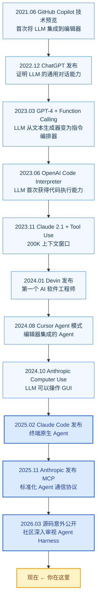
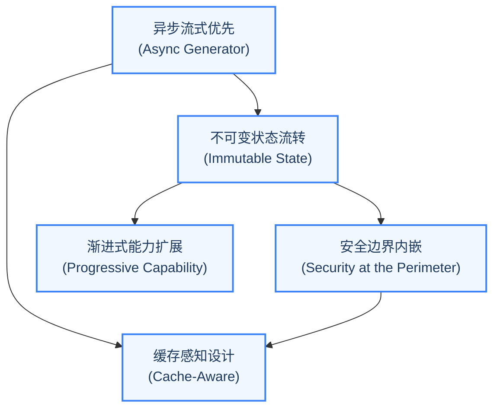

# 前言

## 为什么需要 Agent Harness 而非简单封装

一个常见的误解是：Agent Harness 不过是对 LLM API 的一层封装，加上一些工具定义和调用逻辑。

目前实现Agent Harness的思路有以下几种:

1. 流式输出: LLM 的响应是流式的，用户需要实时看到 Agent 的思考过程，而不是等待整个响应完成。如何在不阻塞主线程的情况下实现增量渲染:目前采用的是“AsyncGenerator”方案

- 如果使用回调，会导致"回调地狱";
- 如果使用 Promise 链，会失去中途取消的能力；
- 如果使用事件发射器，会增加内存管理的复杂度;

2. 权限管控:LLM 可能要求执行 rm -rf /，这显然不应该被允许。权限系统应该在哪一层介入？如果在外层统一拦截，无法处理工具特定的权限逻辑（如 Bash 命令的风险评估）；如果在每个工具内部检查，会导致重复代码和权限策略不一致。如何平衡安全性与效率？

3. 上下文管理：随着对话的进行，上下文窗口会被填满。何时触发上下文压缩？压缩策略如何保证不丢失关键信息？压缩后的上下文如何与缓存系统协同？错误的压缩策略可能导致 Agent "忘记"关键信息，从而做出错误的决策

4. 错误恢复：工具执行可能失败，API 调用可能超时，LLM 的输出可能不符合预期格式。每一种错误场景都需要有对应的恢复策略。没有统一的错误恢复框架，每种错误都需要单独处理，代码会迅速膨胀到不可维护的程度。

5. 状态持久化：用户中断会话后如何恢复？多个子智能体如何共享状态？状态更新如何保证不可变性？如果状态管理混乱，Agent 可能在恢复后产生不一致的行为

6. 可扩展性：如何让第三方开发者安全地注册新工具？如何支持 MCP（Model Context Protocol）等外部协议？如果没有清晰的扩展接口，Agent 的能力将永远受限于原始开发者的想象力。

## 回顾AI编程工具的发展可以看到:

## 技术栈

Claude Code 的技术栈选择体现了"用正确的工具解决正确的问题"的工程哲学：

| 技术组件 | 选择 | 设计考量 | 为什么不选其他方案 |
|---------|------|---------|------------------|
| **运行时** | Bun | 原生 TypeScript 支持、更快的启动速度、原生 `fetch` API | Node.js 需要编译步骤，Deno 的生态成熟度不足 |
| **终端 UI** | React + Ink | 组件化 UI 模型、声明式渲染、React 生态复用 | blessed/ncurses 过于底层，原始 console.log 无法处理复杂布局 |
| **CLI 框架** | Commander.js | 成熟的命令行参数解析、子命令支持 | yargs 更重，oclif 面向大型 CLI 项目 |
| **Schema 验证** | Zod v4 | 运行时类型安全、工具输入校验、JSON Schema 生成 | Joi 不支持类型推导，io-ts 学习曲线陡峭 |
| **LLM SDK** | @anthropic-ai/sdk | Anthropic 官方 SDK、流式响应支持 | 直接 fetch 缺少类型安全和重试逻辑 |

值得注意的是 React + Ink 的选择。Ink 是一个使用 React 组件模型渲染终端 UI 的框架。这意味着 Claude Code 的用户界面不是用传统的 `console.log` 拼接出来的，而是用 React 组件树声明式地描述的。这种选择带来了几个好处：UI 状态管理可以利用 React 的成熟方案（如 `useState`、`useEffect`），组件可以独立测试和复用，复杂 UI（如工具执行进度条、多列布局）的实现更加优雅。

### 从以下几个方面了解Claude Code的设计理念

#### LLM 查询引擎核心

`QueryEngine` 是一个 class，它拥有查询生命周期和会话状态，管理着对话消息历史、文件缓存、用量统计、权限拒绝记录等核心数据。它是对话的"生命周期管理者"。

该引擎被设计为同时服务于交互式 REPL 和无头 SDK 两种运行模式，这体现了架构的通用性考量。通过将核心查询逻辑封装为独立类，不同运行环境可以共享同一套状态管理和生命周期控制代码。

这种"一个核心、多种入口"的设计模式在工程实践中非常有价值。想象一下，如果交互式 REPL 和 SDK 模式使用两套不同的查询逻辑，那么每次修复一个 bug 或添加一个功能，你都需要在两个地方同步修改。而 QueryEngine 的设计确保了无论用户是通过终端交互还是通过 API 调用，都走同一条经过验证的核心路径。

#### 异步生成器对话主循环

这是 Claude Code 最核心、最精巧的模块之一。对话主循环是一个 `AsyncGenerator`，它实现了一个迭代式的对话过程，通过 `yield*` 委托给内部的循环函数。在每一轮迭代中，循环执行以下步骤：

1. 构建 API 请求（系统 Prompt + 消息历史 + 工具定义）
2. 调用 LLM API 并流式接收响应
3. 解析响应中的工具调用指令
4. 通过权限管线校验每个工具调用
5. 执行被允许的工具调用
6. 将工具结果作为新消息注入历史
7. 决定是否继续循环（如果 LLM 返回了新的工具调用）或终止（如果 LLM 返回了纯文本回复）

使用 `AsyncGenerator` 而非普通函数的关键好处是：调用者可以在循环的每一步通过 `yield` 接收中间状态（如流式文本、工具执行进度），而不需要回调或事件发射器。这使得上层代码可以用 `for await...of` 语法优雅地消费整个对话过程。

> **交叉引用：** 第 2 章将深入分析这个异步生成器的内部实现，包括预处理管线、状态转换模型和依赖注入设计。

状态管理方面，跨迭代状态被封装在一个不可变的 State 对象中，每次迭代时通过整体替换而非逐字段修改。这种不可变状态流转的模式使得状态的每次变化都是可追溯的。

#### 工具类型系统基石

工具类型模块定义了 Claude Code 中所有工具必须遵循的类型契约。这是一个典型的"接口即架构"的案例——通过定义清晰的类型接口，工具系统的架构约束被编译器强制执行。

这个类型定义中蕴含了丰富的架构决策：

- 工具的执行方法接收权限检查回调，意味着权限检查被内嵌到了工具执行流程中，而非外部拦截。
- 进度回调支持工具执行过程的增量进度报告，这是流式 UI 的基础。
- 并发安全声明标记工具是否可以并行执行，这影响调度策略。
- 中断行为定义用户中断时的行为（取消还是阻塞），这是用户体验的关键细节。
- 破坏性标记标识工具是否执行不可逆操作，这是权限系统的重要输入。

> **交叉引用：** 第 3 章将详细解析工具类型系统的设计，包括 `buildTool` 工厂函数、并发分区策略和 StreamingToolExecutor。

#### 工具注册中心

工具注册模块中的核心函数返回所有可用工具的完整列表，是工具系统的"单一事实来源"（Single Source of Truth）。值得注意的设计细节：

1. **条件注册**：某些工具通过 Feature Flag 控制，如 REPL 工具只在内部版本中可用，定时任务工具只在特定功能模式下启用。这使得同一份代码可以服务于不同的产品形态。
2. **延迟加载**：部分工具使用动态导入而非静态导入来避免循环依赖和减少启动时间。
3. **工具过滤**：工具过滤函数在将工具列表发送给 LLM 之前，会根据权限上下文过滤掉被禁止的工具，确保模型甚至无法"看到"它不应该使用的工具。

条件注册和延迟加载的组合体现了"按需加载"的工程哲学。在 Agent 系统中，工具数量可能达到数十甚至上百个（尤其是通过 MCP 协议扩展后），如果全部在启动时加载，不仅会拖慢启动速度，还可能因为循环依赖导致初始化错误。Claude Code 的方案确保了只有真正需要的工具才会被加载到内存中。

---

## Agent Harness 设计哲学的五大原则

通过阅读 Claude Code 的架构，我们可以提炼出五个贯穿始终的设计原则。这些原则并非孤立的技巧，而是相互支撑的架构决策网络。每一个原则都回答了一个核心的"为什么"：为什么不选更简单的方案？如果不这样设计会怎样？

### 原则一：异步流式优先（Async Generator First）

Claude Code 的整个对话循环建立在 `AsyncGenerator` 之上。这不是一个随意的技术选择，而是一个深刻的架构决策。

传统的 LLM 调用通常采用请求-响应模式：发送 Prompt，等待完整响应，处理结果。但 Agent 的交互模式是根本不同的——Agent 可能在一个用户请求中执行多轮工具调用，每一轮都可能产生需要实时展示给用户的中间状态（思考过程、工具调用计划、执行进度）。

`AsyncGenerator` 完美地匹配了这个需求：

- **增量输出**：通过 `yield` 逐步产出流式事件，上层代码可以实时渲染。
- **可中断性**：调用者可以随时通过 `generator.return()` 或 `generator.throw()` 终止生成器。
- **背压控制**：如果消费者处理速度跟不上生产速度，生成器会自动暂停，避免内存溢出。

这种设计使得 Claude Code 的对话循环成为一个"事件流"而非"请求-响应对"。上层代码只需要一个 `for await...of` 循环就可以消费整个对话过程的所有事件。

**如果不这样设计会怎样？** 如果使用回调模式，每添加一种新事件类型就需要注册新的回调函数，随着事件类型的增多，代码会变成难以维护的"回调地狱"。如果使用 Promise 链，虽然解决了回调地狱，但失去了中途取消的能力——用户按 Ctrl+C 时无法优雅地停止正在进行的 API 调用。如果使用事件发射器（EventEmitter），虽然解决了取消问题，但引入了内存泄漏风险（忘记移除监听器）和类型安全问题（事件名是字符串）。

AsyncGenerator 是唯一同时满足"流式输出"、"可取消"和"类型安全"三个需求的方案。

### 原则二：安全边界内嵌（Security at the Perimeter）

Claude Code 的权限系统不是一个附加的安全层，而是被内嵌到了架构的核心管线中。工具调用从被 LLM 提出到最终执行，需要经过多个安全检查点：

1. **工具可见性过滤**：在将工具列表发送给 LLM 之前，根据权限规则过滤掉被禁止的工具。模型甚至无法"看到"它不应该使用的工具。
2. **输入校验**：工具的 `validateInput` 方法在权限检查之前执行，拒绝格式不合法的参数。
3. **权限决策**：`canUseTool` 回调综合考量权限模式（默认/Auto/Bypass）、工具的危险等级、用户的历史决策等因素，做出允许/拒绝/询问的决策。
4. **运行时防护**：即使通过了上述检查，工具执行过程中仍有沙箱限制、超时控制、输出大小限制等防护措施。

这个四阶段管线的设计哲学是"纵深防御"（Defense in Depth）——没有单一的安全检查点是"银弹"，但每一层都可以独立短路，阻止不安全的操作。

**为什么不使用简单的白名单？** 白名单方案看似简单，但存在致命缺陷：它假设所有操作都可以事先分类为"安全"或"不安全"。但现实中，安全性是上下文相关的——`rm -rf node_modules` 在开发环境中是安全的，但 `rm -rf /etc` 是危险的。同一个 Bash 工具、同一个命令模式，在不同参数下的风险等级完全不同。四阶段管线允许每一层根据上下文做出更精细的判断。

> **交叉引用：** 第 4 章将深入分析权限管线的四个阶段，包括规则匹配优先级、分类器自动审批和权限持久化机制。

### 原则三：缓存感知设计（Cache-Aware Architecture）

在 LLM 的 API 计价模型中，Prompt 缓存（Prompt Caching）可以显著降低成本和延迟。Claude Code 的架构从多个层面考虑了缓存友好性：

- **系统 Prompt 稳定性**：系统 Prompt 的构建方式被精心设计，确保在工具列表不变的情况下，Prompt 的字节内容保持一致，从而命中 API 侧的 Prompt 缓存。
- **子智能体的缓存共享**：Fork 模式下的子智能体会继承父智能体的 `renderedSystemPrompt`，避免重新生成可能因配置变化而不同的 Prompt，保证缓存命中率。
- **消息历史的不可变性**：已发送给 API 的消息不会被修改，只有追加新消息的操作，这保证了缓存键的稳定性。

缓存感知设计的影响是深远的：它不仅降低了 API 成本，还通过减少重复计算提高了响应速度，这对于需要频繁与 LLM 交互的 Agent 系统尤为关键。

**如果不这样设计会怎样？** 一个不关心缓存的 Agent 系统可能在每次 API 调用时都重新构建系统 Prompt，导致：(1) 每次 API 调用都需要处理完整的 Prompt，增加延迟和成本；(2) 微小的配置变化（如工具列表的排序变化）可能导致缓存全面失效；(3) 在子智能体场景下，父子智能体之间无法共享已缓存的 Prompt，导致重复计算。对于每天执行数百次 API 调用的生产级 Agent，这些浪费会迅速累积成可观的成本。

### 原则四：渐进式能力扩展（Progressive Capability）

Claude Code 提供了四级扩展模型，从内建到外部、从简单到复杂：

| 扩展级别 | 机制 | 适用场景 | 扩展者角色 |
|---------|------|---------|----------|
| **工具（Tool）** | 实现 `Tool` 类型接口 | 添加新的原子操作能力 | 核心开发者 |
| **技能（Skill）** | Markdown + 脚本的声明式工具 | 封装可复用的任务模板 | 高级用户 |
| **插件（Plugin）** | 带生命周期的工具包 | 组织相关工具和配置 | 生态开发者 |
| **MCP 服务器** | 标准化协议的外部工具集成 | 第三方工具生态 | 第三方开发者 |

这四级扩展模型的设计哲学是"渐进增强"：对于简单的需求，声明一个 Skill 就够了；对于复杂的集成，可以通过 MCP 协议连接外部服务。每一级都建立在前一级的基础之上，而非替代它。

特别值得关注的是 MCP（Model Context Protocol）的集成方式。Claude Code 不是一个封闭系统——它通过 MCP 协议可以动态发现和调用外部工具服务器提供的工具，这使得 Agent 的能力边界不是由开发者预设的，而是可以在运行时动态扩展的。

**如果不采用渐进式扩展会怎样？** 两种极端都不可取。如果只有"工具"一级扩展，第三方开发者必须修改核心代码才能添加新能力，这会严重限制生态系统的生长。如果只提供 MCP 一级扩展，简单的自定义需求也需要搭建一个完整的工具服务器，门槛过高。渐进式扩展让每一类贡献者都能在最适合自己的抽象层次上工作。

> **交叉引用：** 第三部分将详细讲解 MCP 协议的集成方式、插件系统的设计以及 Skill 的声明式工具定义。

### 原则五：不可变状态流转（Immutable State Flow）

Claude Code 的状态管理借鉴了 Redux/Zustand 的不可变状态模式。核心状态存储由一个极简的 store 实现完成。这个实现虽然简洁，但蕴含了重要的设计决策：

- **Updater 函数模式**：状态更新接收一个 `(prev: T) => T` 函数，而非新状态值本身。这确保了状态的每次更新都基于前一个状态，避免了竞态条件。
- **引用相等性检查**：通过引用比较确保只有真正发生变化时才触发通知，避免不必要的重渲染。
- **订阅/取消订阅模式**：监听器通过集合管理，返回清理函数，防止内存泄漏。

在对话循环层面，不可变性同样被严格遵守：跨迭代状态通过整体替换的方式更新，每次迭代开始时从状态对象解构出需要的字段，确保读操作使用的是不可变快照。

不可变状态流转的好处是多方面的：状态变化可预测、可追溯、可调试；在子智能体场景下，父智能体可以安全地将状态快照传递给子智能体而不担心被意外修改；在推测执行（Speculation）场景下，状态回滚变得简单而安全。

**如果不这样设计会怎样？** 如果使用可变状态（直接修改对象的字段），在并发场景下会出现经典的竞态条件：工具 A 的执行修改了状态，但工具 B 在读取状态时看到的是修改了一半的不一致数据。在子智能体场景下更危险——子智能体可能意外修改父智能体的状态，导致主循环的行为变得不可预测。这类 bug 极难复现和调试，因为它取决于异步操作的具体调度顺序。

---

## 系列导航

本系列基于《御舆：解码 Agent Harness》([lintsinghua/claude-code-book](https://github.com/lintsinghua/claude-code-book)) 整理，共 7 篇：

| 篇目 | 覆盖章节 | 核心内容 |
|------|---------|---------|
| **本篇 (01)** | Ch01 智能体编程的新范式 | 五大设计原则、技术栈、架构全景 |
| [02 对话循环](./agentic-loop-02) | Ch02 对话循环 | AsyncGenerator 主循环、十种终止原因、QueryDeps |
| [03 工具系统](./agentic-loop-03) | Ch03 工具系统 | Tool 五要素协议、并发分区、StreamingToolExecutor |
| [04 权限管线](./agentic-loop-04) | Ch04 权限管线 | 四阶段管线、五种权限模式、BashTool 精细控制 |
| [05 核心子系统](./agentic-loop-05) | Ch05-08 核心系统篇 | 配置、记忆、上下文压缩、钩子系统 |
| [06 高级模式](./agentic-loop-06) | Ch09-12 高级模式篇 | 子智能体 Fork、协调器编排、技能系统、MCP 集成 |
| [07 工程实践](./agentic-loop-07) | Ch13-15 工程实践篇 | 性能优化、Plan 模式、构建你自己的 Agent Harness |

- [在线阅读原书](https://lintsinghua.github.io/)
- [GitHub 仓库](https://github.com/lintsinghua/claude-code-book)

