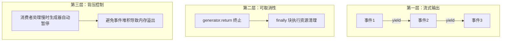
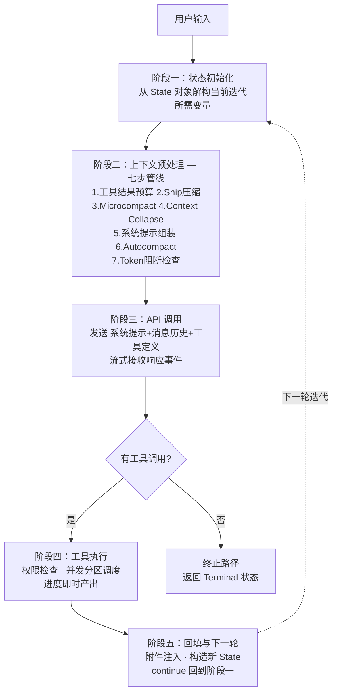
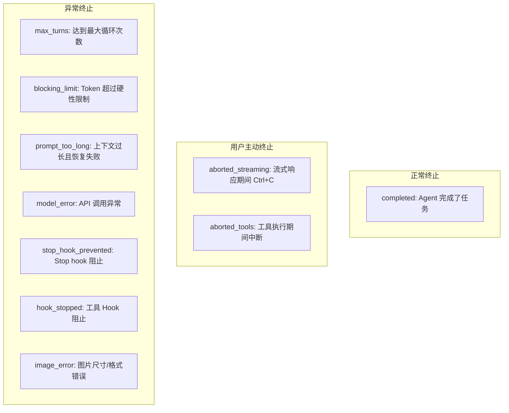
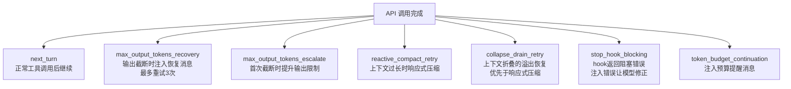

# 第 2 章：对话循环 — Agent 的心跳

> 本章对应《御舆》第 2 章，是第 1 章中提到的"异步生成器对话主循环"的深入展开。如果说第 1 章建立了 Agent Harness 的全景认知，第 2 章则是进入核心引擎的内部——理解 Agent "一次心跳"到底发生了什么。

---

## 核心知识点一览

| 知识点 | 关键概念 | 与第 1 章的联系 |
|--------|---------|---------------|
| 异步生成器主循环 | `async function*` + `while(true)` | 第 1 章"异步流式优先"原则的具体实现 |
| 五种 yield 事件 | stream_request_start, StreamEvent, Message, Tombstone, Summary | 第 1 章"增量输出"的事件类型细分 |
| Turn 生命周期 | 五阶段：初始化→预处理→API调用→工具执行→回填 | 第 1 章"对话主循环7步"的展开版 |
| 十种终止原因 | completed, aborted, max_turns, model_error 等 | 第 1 章"错误恢复"挑战的具体解决方案 |
| QueryDeps 依赖注入 | 4 个核心依赖：callModel, microcompact, autocompact, uuid | 第 1 章"可测试性"的工程实现 |
| 七种 Continue 路径 | next_turn, recovery, escalate, compact, collapse 等 | 第 1 章"不可变状态流转"原则的状态机展开 |

---

## 2.1 AsyncGenerator 主循环骨架

Claude Code 的对话主循环是一个 `async function*` 定义的异步生成器。它不是一次性执行完毕的普通函数，而是一个可暂停、可恢复、可取消的流程。每一次 `yield` 就像心跳的一次搏动，将流式事件推向调用方。

### 为什么必须是 AsyncGenerator

传统 LLM 调用是"请求-响应"模式，但 Agent 的交互从根本上不同：

- 模型响应是逐 token 到达的，需要实时展示
- 工具执行可能耗时数分钟，期间需要进度反馈
- 用户可能随时 Ctrl+C 中断

AsyncGenerator 提供了三层能力来匹配这些需求：



### 函数签名伪代码

```typescript
// 对话循环入口 — 异步生成器函数
async function* query(params: QueryParams): AsyncGenerator<
  // Yield 类型：五种事件的联合体
  | StreamRequestStart    // API 请求开始信号
  | StreamEvent           // LLM 原始流式事件（token 增量、thinking 块、tool_use 块）
  | Message               // 结构化消息（UserMessage / AssistantMessage / SystemMessage）
  | TombstoneMessage      // 标记已废弃的消息（流式回退时使用）
  | ToolUseSummaryMessage, // 工具调用摘要（UI 折叠展示）
  // Return 类型：终结状态
  Terminal                // { reason: TerminalReason }
> {
  // 通过 yield* 委托给内部循环函数
  return yield* queryLoop(params);
}
```

> **我的理解：** 这里"yield 过程、return 结论"的模式设计得很精妙。上层代码用 `for await...of` 消费事件流时，循环结束后可以从 generator 的 return value 中获取终止原因。这意味着"处理中间状态"和"处理最终结果"在调用方是天然分离的，不需要额外的状态标记。

### 与其他方案的工程对比

| 方案 | 流式输出 | 可取消 | 类型安全 | 额外依赖 |
|------|---------|--------|---------|---------|
| 回调 (Callback) | 需注册多个回调 | 需手动管理取消标记 | 弱（事件名是字符串） | 无 |
| Promise 链 | 只能 resolve 一次 | 不支持 | 强 | 无 |
| EventEmitter | 支持 | 需手动移除监听器 | 弱 | 无 |
| RxJS Observable | 支持 | 支持 | 强 | 引入重依赖 |
| **AsyncGenerator** | **原生 yield** | **原生 .return()** | **强** | **无** |

---

## 2.2 五种流式事件类型

对话循环中流转的事件共五类，构成对话过程的"心跳信号"：

### 事件类型详解

```typescript
// 1. API 请求开始信号 — 告知 UI "正在思考..."
type StreamRequestStart = { type: "stream_request_start" };

// 2. LLM 原始流式事件 — 直播流中的每一帧
type StreamEvent =
  | ContentBlockDelta    // 文本 token 增量
  | ThinkingBlock        // thinking 块
  | ToolUseBlock;        // tool_use 块（模型决定调用工具）

// 3. 结构化消息 — 经过解析的"回放"
type Message =
  | UserMessage          // 用户输入 + 工具执行结果（API 角色为 user）
  | AssistantMessage     // 模型回复（可同时包含文本和 tool_use）
  | SystemMessage        // 系统通知（不参与 API 通信，仅 UI 展示）
  | AttachmentMessage    // 附件（文件变更、CLAUDE.md 内容）
  | ProgressMessage;     // 工具执行进度（Bash 输出流、文件读取进度）

// 4. 墓碑消息 — 标记消息"失效"（流式回退时使用）
type TombstoneMessage = { type: "tombstone"; targetId: string };

// 5. 工具调用摘要 — 折叠展示长列表的工具调用
type ToolUseSummaryMessage = { type: "tool_use_summary"; summary: string };
```

> **我的理解：** UserMessage 承载 tool_result 这个设计初看反直觉——工具结果为什么是"用户"角色？原因是 API 协议层面只有 system/user/assistant 三种角色，工具结果需要被模型"看到"，所以必须以 user 角色发送。这是一个 API 协议约束驱动的设计决策。

---

## 2.3 一个完整 Turn 的五阶段生命周期

一个 Turn = 从用户按下回车到模型完成响应（或决定调用工具）的完整流程。



### 阶段一：状态初始化

`queryLoop` 是一个 `while(true)` 无限循环。在循环顶部，函数从状态对象中解构出当前迭代所需的变量：

```typescript
// 伪代码：状态初始化
while (true) {
  const {
    messages,           // 消息列表
    toolUseContext,     // 工具使用上下文
    autocompactTracking,// 自动压缩追踪
    recoveryCount,      // 输出 token 恢复计数器
    turnCount,          // turn 计数
    transition,         // 上一次 continue 的原因
  } = state;
  // ...
}
```

关键设计：**状态在"读"和"写"之间有明确的分界线。** 迭代开始时一次性读取所有字段（快照语义），迭代结束时一次性写入新状态对象（原子更新语义）。

### 阶段二：上下文预处理 — 七步压缩管线

这是对话循环中最精巧的部分之一。七步管线遵循一个核心原则：**压缩手段从轻量到重量排列，每一步先尝试最小代价方案。**

| 步骤 | 名称 | 策略 | 类比 |
|------|------|------|------|
| 1 | 工具结果预算 | 截断/持久化过大结果到磁盘 | 内存分页：数据太大就存到磁盘 |
| 2 | Snip 压缩 | 直接截断过长的消息内容 | 最"粗暴"的裁剪 |
| 3 | Microcompact | 缓存友好的轻量级压缩 | 复用 API 已缓存的 token |
| 4 | Context Collapse | 将连续消息折叠为紧凑视图 | 折叠"好的""明白了"等冗余消息 |
| 5 | 系统提示组装 | 合并基础提示与动态上下文 | 影响缓存命中率 |
| 6 | Autocompact | 超阈值时执行全量摘要 | 最后一道防线 |
| 7 | Token 阻断检查 | 超硬性限制直接返回错误 | 快速失败，不发送注定失败的请求 |

> **我的理解：** 这个管线的设计让我联想到网络协议中的拥塞控制：先用轻量手段（如 Nagle 算法），不行再用重量手段（如丢包重传）。每一步压缩都会丢失一些信息，所以要尽量延迟最"激进"的手段。Microcompact 的缓存友好设计尤其精妙——它在压缩的同时考虑了不要破坏 API 侧的 Prompt 缓存。

### 阶段三：API 调用（流式接收）

使用注入的 `callModel` 依赖发起流式请求。一个微妙之处：模型可能在一个响应中同时包含文本和工具调用——先输出"我来看看你的文件"，再附加 Read 工具调用。循环需要同时 yield 文本事件让 UI 渲染，又收集 tool_use 块为后续执行准备。

### 阶段四：工具执行

根据是否启用流式执行，选择 StreamingToolExecutor 或批量执行。工具执行同样是 AsyncGenerator，每产出一个结果就 yield 给 UI 并收集到结果数组中。

> **设计亮点：** "结果收集"和"结果传递"通过同一个 yield 操作完成——工具结果既被收集到数组供下一轮 API 调用使用，又被 yield 给 UI 实时展示。这避免了额外的状态同步逻辑。

### 阶段五：回填与下一轮

工具执行完毕后执行附件注入（CLAUDE.md 变更、文件变更通知等），然后将所有消息打包为新的 State 对象，通过 `continue` 回到循环顶部。

---

## 2.4 十种终止原因

对话循环的终止是精心设计的，十种终止原因可归为三类：



| 终止原因 | 触发条件 | 清理逻辑 |
|----------|---------|---------|
| `completed` | 模型正常回复且无工具调用 | 正常退出 |
| `aborted_streaming` | 用户 Ctrl+C 中断流式响应 | 取消 API 调用 |
| `aborted_tools` | 工具执行期间中断 | 取消当前工具、丢弃结果 |
| `max_turns` | 达到最大循环次数 | 停止并说明原因 |
| `blocking_limit` | Token 超过硬性限制 | 报错退出 |
| `prompt_too_long` | 上下文过长且所有恢复手段失败 | 报错退出 |
| `model_error` | API 调用异常（网络/服务端） | 优雅降级 |
| `stop_hook_prevented` | Stop hook 返回拒绝 | 停止并说明原因 |
| `hook_stopped` | 工具 hook 阻止继续 | 停止并说明原因 |
| `image_error` | 图片尺寸/格式不合法 | 报错退出 |

> **我的理解：** 十种终止原因的精细划分不是过度设计，而是"可观测性"的基础。调试 Agent 行为时，终止原因是定位问题的第一线索。如果所有错误都返回笼统的 "error"，开发者将无从判断是 API 超时、上下文溢出还是用户中断。

---

## 2.5 七种 Continue 路径（状态转换模型）

整个循环的状态转换由 State + Continue + Terminal 三元模型驱动：

```typescript
// 三元状态模型
type State = {
  messages: Message[];
  toolUseContext: ToolContext;
  autocompactTracking: CompactState;
  recoveryCount: number;
  turnCount: number;
  transition: ContinueReason | null; // 上一次 continue 的原因
};

type Continue = {
  reason: ContinueReason;
  state: State;  // 全新的状态对象
};

type Terminal = {
  reason: TerminalReason;
};
```

### 七种 Continue 路径详解



| 路径 | 触发条件 | 行为 |
|------|---------|------|
| `next_turn` | 正常工具调用后 | 扩展消息列表，turn+1 |
| `max_output_tokens_recovery` | 模型输出被截断 | 注入"请从中断处继续"消息，最多 3 次 |
| `max_output_tokens_escalate` | 首次截断 | 先尝试提升 token 限制，失败再走 recovery |
| `reactive_compact_retry` | 上下文溢出 | 执行响应式压缩，失败则终止 |
| `collapse_drain_retry` | 上下文折叠溢出 | 优先于 reactive compact（信息损失更小） |
| `stop_hook_blocking` | Hook 返回阻塞错误 | 将错误注入消息列表，让模型有机会修正 |
| `token_budget_continuation` | Token 预算不足 | 注入预算提醒，类似"流量余额不足提醒" |

> **我的理解：** `transition` 字段的设计特别值得学习——它让每一轮迭代知道"我是怎么来到这里的"。这在调试时非常有用：追溯 transition 链就像追踪面包屑，可以快速定位哪一次转换引入了问题。`stop_hook_blocking` 路径也很有趣——错误不是终止条件，而是反馈信号，让模型有机会调整策略。

---

## 2.6 QueryDeps 依赖注入

对话主循环的可测试性依赖于一个精简的依赖接口：

```typescript
interface QueryDeps {
  callModel: (params: ModelCallParams) => AsyncGenerator<StreamEvent>;
  microcompact: (messages: Message[]) => Promise<Message[]>;
  autocompact: (messages: Message[], budget: number) => Promise<Message[]>;
  uuid: () => string;
}

// 生产环境默认实现
const productionDeps: QueryDeps = {
  callModel: realApiCallModel,
  microcompact: realMicrocompact,
  autocompact: realAutocompact,
  uuid: crypto.randomUUID,
};

// 测试环境可注入 fake 实现
const testDeps: QueryDeps = {
  callModel: fakeLLMResponse,
  microcompact: identity,    // 不压缩
  autocompact: identity,     // 不压缩
  uuid: () => "test-uuid-1", // 固定值
};
```

### 为什么不用 spy-per-module

没有依赖注入时，测试需要模块级 spy/mock：

- 耦合测试代码与模块内部结构（模块重命名/移动时测试需同步修改）
- 多个测试文件重复相同的 mock 样板代码
- 模块缓存可能导致测试间状态泄漏

QueryDeps 的四个依赖恰好覆盖了循环中所有"与外部世界交互"的边界点。将它们抽象为接口后，循环内部就变成了纯逻辑——可以在不访问 API 的情况下验证状态转换。

### 为什么用函数式而非 Class

| 特性 | 函数式 (`async function*`) | Class |
|------|---------------------------|-------|
| 状态隔离 | 闭包天然隔离 | 需手动管理实例属性 |
| 并发安全 | 每次调用创建新闭包 | 多实例可能共享属性 |
| 取消 | `.return()` + finally | 需手动实现 |
| 可组合性 | `yield*` 委托 | 需要继承或装饰器 |
| 背压 | yield 自动暂停 | 需手动实现 |

> **我的理解：** 这里的函数式选择不是"品味问题"，而是基于严格工程需求的决策。特别是在子智能体场景下——如果对话循环是 class 方法，父子智能体可能通过实例属性意外共享状态，导致极难复现的并发 bug。函数闭包是最安全的状态容器。

---

## 文件结构参考

Claude Code 中与对话循环相关的核心模块组织：

```
src/
├── core/
│   ├── query.ts              # query() 入口 — AsyncGenerator 主函数
│   ├── queryLoop.ts           # queryLoop() — while(true) 主循环实现
│   ├── queryDeps.ts           # QueryDeps 接口 + 生产环境默认实现
│   ├── types/
│   │   ├── messages.ts        # Message, UserMessage, AssistantMessage 等类型
│   │   ├── events.ts          # StreamEvent, StreamRequestStart 等事件类型
│   │   ├── terminal.ts        # Terminal, Continue, TerminalReason 等类型
│   │   └── state.ts           # State 类型定义
│   └── preprocess/
│       ├── snip.ts            # Snip 压缩
│       ├── microcompact.ts    # Microcompact 缓存友好压缩
│       ├── contextCollapse.ts # Context Collapse 上下文折叠
│       ├── autocompact.ts     # Autocompact 全量摘要
│       └── tokenCheck.ts      # Token 阻断检查
└── ui/
    └── components/
        └── StreamRenderer.tsx # 消费 AsyncGenerator 事件流的 UI 层
```

---

## 关键要点总结

1. **AsyncGenerator 是 Agent 循环的最佳载体** — `yield` 提供流式输出，`yield*` 提供子生成器委托，`.return()` 提供确定性取消。不是折中，是唯一同时满足流式、可取消、类型安全的方案。

2. **七步预处理管线从轻到重** — Snip → Microcompact → Context Collapse → Autocompact，每步都先尝试最小代价方案，延迟最激进的压缩手段。

3. **状态不可变，转换可追踪** — 每次 continue 构造新 State 对象，`transition` 字段记录来源，形成可追溯的"面包屑"链。

4. **依赖注入使测试成为可能** — 4 个核心依赖（callModel, microcompact, autocompact, uuid）覆盖了所有外部交互边界。

5. **终止不是失败，是设计** — 十种终止原因是可观测性的基础，每种都有对应的清理逻辑。

---

## 参考链接

- [本章原文：对话循环 — Agent 的心跳](https://github.com/lintsinghua/claude-code-book/blob/main/%E7%AC%AC%E4%B8%80%E9%83%A8%E5%88%86-%E5%9F%BA%E7%A1%80%E7%AF%87/02-%E5%AF%B9%E8%AF%9D%E5%BE%AA%E7%8E%AF-Agent%E7%9A%84%E5%BF%83%E8%B7%B3.md)
- [在线阅读](https://lintsinghua.github.io/)
- [上一篇：智能体编程的新范式](./agentic-loop-01)
- [下一篇：工具系统 — Agent 的双手](./agentic-loop-03)
