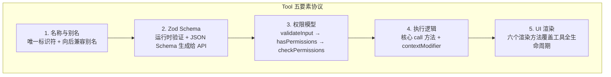
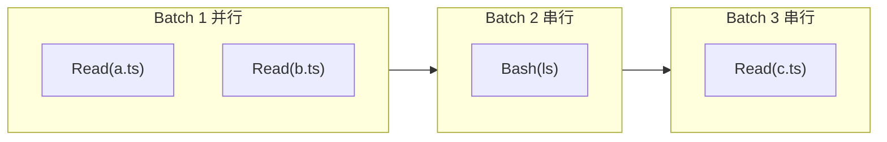
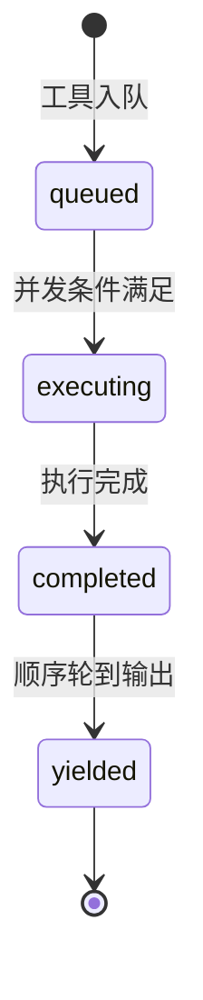
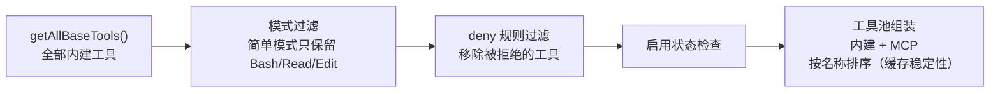

# 第 3 章：工具系统 — Agent 的双手

> 本章对应《御舆》第 3 章。如果说第 2 章的对话循环是 Agent 的心脏，工具系统就是 Agent 的四肢——让 Agent 从"只能说话"进化到"能够做事"。

---

## 核心知识点一览

| 知识点 | 关键概念 | 与前文的联系 |
|--------|---------|-------------|
| Tool 五要素协议 | 名称、Schema、权限、执行、渲染 | 第 1 章"工具类型系统基石"的完整展开 |
| buildTool 工厂函数 | fail-closed 默认值、类型计算 | 第 1 章"渐进式能力扩展"的实现 |
| 45+ 工具 × 12 类 | BashTool、文件三件套、搜索双雄等 | 第 1 章"工具注册中心"的清单 |
| 并发分区算法 | isConcurrencySafe、批次划分 | 第 2 章"工具执行阶段"的调度细节 |
| StreamingToolExecutor | 四阶段状态机、边接收边执行 | 第 1 章"异步流式优先"原则的工具层实现 |
| 延迟工具发现 | ToolSearchTool、schema 按需加载 | 第 1 章"缓存感知设计"的节省 token 策略 |

---

## 3.1 Tool 五要素协议

Claude Code 中的每个工具都遵循 `Tool<Input, Output, Progress>` 的统一类型契约。这是"接口即架构"的典型案例——通过类型系统强制执行所有架构约束。

### 五要素拓扑



### 伪代码：Tool 类型接口

```typescript
interface Tool<
  Input extends AnyObject,
  Output,
  Progress extends ToolProgressData = never
> {
  // 要素一：名称
  name: string;
  aliases?: string[];

  // 要素二：Schema（双重职责：运行时验证 + API 通信）
  inputSchema: ZodType<Input>;

  // 要素三：权限模型（三层分离）
  validateInput?: (input: unknown) => ValidationResult;
  hasPermissionsToUseTool?: (ctx: PermissionContext) => PermissionResult;
  checkPermissions?: (input: Input) => PermissionResult;

  // 要素四：执行逻辑
  call(
    input: Input,
    context: ToolUseContext,
    canUseTool: PermissionCheckFn,
    parentMessage: Message,
    onProgress?: (progress: Progress) => void,
  ): Promise<{ output: Output; contextModifier?: ContextModifier }>;

  // 要素五：UI 渲染（覆盖工具调用的"生老病死"）
  renderToolUseMessage: (input: Input) => ReactNode;        // 开始
  renderToolUseProgressMessage?: (p: Progress) => ReactNode; // 进行中
  renderToolResultMessage: (output: Output) => ReactNode;    // 成功
  renderToolUseRejectedMessage?: () => ReactNode;            // 被拒
  renderToolUseErrorMessage?: (err: Error) => ReactNode;     // 出错
  renderGroupedToolUse?: (items: ToolUse[]) => ReactNode;    // 并行分组

  // 元数据标记
  isReadOnly(): boolean;           // 默认 false（fail-closed）
  isConcurrencySafe(): boolean;    // 默认 false（fail-closed）
  isDestructive?(input: Input): boolean;
  userFacingName(): string;
}
```

> **我的理解：** 三个泛型参数 `<Input, Output, Progress>` 的分离是精心设计的——Input 用 Zod 约束确保 LLM 输出的参数合法，Output 自由定义适应不同工具，Progress 独立出来让工具可以在执行中提供流式反馈。这三者各自有独立的类型空间，编译器可以分别检查，不会混淆。

### Zod Schema 的双重职责

```typescript
// 一个 Schema 同时用于两个目的：
const fileReadSchema = z.object({
  path: z.string().describe("要读取的文件路径"),
  offset: z.number().optional().describe("起始行号"),
  limit: z.number().optional().describe("读取行数"),
});

// 职责 1：运行时验证（拦截 LLM 的非法输出）
const parsed = fileReadSchema.parse(llmOutput); // 类型不符则抛出

// 职责 2：转换为 JSON Schema 发送给 API
const jsonSchema = zodToJsonSchema(fileReadSchema);
// → 模型看到参数说明，知道怎么调用这个工具
```

---

## 3.2 buildTool 工厂函数

`buildTool` 是创建工具的标准入口，遵循 **fail-closed 原则**：

```typescript
function buildTool<I, O, P>(partial: Partial<Tool<I, O, P>>): Tool<I, O, P> {
  return {
    // 安全性相关默认值全部为 false（fail-closed）
    isReadOnly: () => false,          // 默认非只读 → 需要权限检查
    isConcurrencySafe: () => false,   // 默认非并发安全 → 串行执行
    isDestructive: () => false,       // 默认非破坏性
    // ...其他安全默认值
    ...partial,                        // 开发者显式覆盖
  };
}
```

> **我的理解：** 这个设计就像机场安检——默认假设所有行李都需要检查（fail-closed），只有经过认证的旅客才能走快速通道。如果反过来（fail-open），任何一个漏检都可能造成安全事故。工具必须主动声明自己安全才能享受并发等优化。

---

## 3.3 工具分类清单（45+ 工具 × 12 类）

| 类别 | 工具 | 并发安全 | 要点 |
|------|------|---------|------|
| **执行** | BashTool | 否 | 最强大也最危险，集成 AST 解析和沙盒 |
| **文件读取** | FileReadTool | 是 | 维护文件状态缓存，避免重复 I/O |
| **文件编辑** | FileEditTool | 否 | `old_string→new_string` 精确替换，非行号 |
| **文件写入** | FileWriteTool | 否 | 权限最严格的文件操作 |
| **搜索** | GlobTool, GrepTool | 是 | 结构化输出，比 Bash 中的 find/grep 更优 |
| **笔记本** | NotebookEditTool | 否 | Jupyter Notebook 编辑 |
| **网络** | WebFetchTool, WebSearchTool | 是 | URL 内容获取、搜索 |
| **智能体** | AgentTool | 否 | 子智能体入口，Fork 独立上下文 |
| **任务** | TodoWriteTool 等 | 视情况 | 任务管理 |
| **规划** | EnterPlanModeTool 等 | 否 | 模式切换 |
| **MCP** | ListMcpResourcesTool 等 | 是 | 外部工具协议 |
| **搜索发现** | ToolSearchTool | 是 | 延迟加载工具 schema |

### FileEditTool 为什么用字符串匹配而非行号

```typescript
// ❌ 行号模式（脆弱）
edit({ file: "a.ts", line: 5, newContent: "..." })
// 问题：读取和编辑之间如果文件被修改，行号可能偏移

// ✅ 精确字符串匹配（幂等）
edit({ file: "a.ts", old_string: "const x = 1", new_string: "const x = 2" })
// 只要目标字符串存在，编辑就能正确定位
```

> **我的理解：** 这是幂等性设计的好案例。行号是位置敏感的，在并发编辑场景下极易出错；字符串匹配是内容敏感的，只要目标片段没被触及，编辑就是安全的。文件操作故意缺少 Delete 工具——删除是不可逆操作，通过 BashTool 的 `rm` 命令实现会触发更严格的权限检查。

---

## 3.4 并发分区算法

工具编排引擎的核心挑战：在 **并行性**（速度）、**安全性**（无数据竞争）、**顺序性**（结果顺序一致）之间取得平衡。

### 分区规则

```typescript
function partitionToolCalls(calls: ToolCall[]): Batch[] {
  const batches: Batch[] = [];
  for (const call of calls) {
    const safe = call.tool.isConcurrencySafe();
    const lastBatch = batches[batches.length - 1];
    if (safe && lastBatch?.safe) {
      lastBatch.calls.push(call); // 合并到同一并发批次
    } else {
      batches.push({ safe, calls: [call] }); // 开启新批次
    }
  }
  return batches;
  // 并发安全批次 → 并行执行（上限 10 个）
  // 非安全批次 → 串行执行
}
```

### 分区示例

输入序列：`[Read(a.ts), Read(b.ts), Bash(ls), Read(c.ts)]`



> **我的理解：** Read(c.ts) 为什么不能和 Read(a.ts) 合并？因为中间隔了一个 Bash(ls)。虽然 `ls` 本身无副作用，但 BashTool 声明为非并发安全（任何 Bash 命令都可能有副作用），所以它切断了并发批次。分区算法是贪心的——只要遇到非安全工具就开启新批次，这是 fail-closed 原则在调度层面的体现。

---

## 3.5 StreamingToolExecutor 四阶段状态机

StreamingToolExecutor 不等模型响应完成就开始执行工具——"边接收边执行"的流水线模式。

### 性能对比

```
传统模式：模型生成(2s) → 批量执行(5s) = 7s
流式模式：模型生成(2s，期间工具陆续启动) → 补充执行 = ~3s（提升 >50%）
```

### 四阶段状态机



| 阶段 | 含义 | 关键约束 |
|------|------|---------|
| `queued` | 等待执行条件 | 当前无非安全工具在执行时才启动 |
| `executing` | 正在执行 | 并发安全工具可并行，否则互斥 |
| `completed` | 结果已收集 | 但未 yield（需维持与请求相同的顺序） |
| `yielded` | 结果已产出 | 生命周期结束 |

### 关键设计决策

```typescript
class StreamingToolExecutor {
  // 1. 顺序保证：结果 yield 顺序 = 请求顺序
  //    即使工具 B 先完成，也要等工具 A yield 后才 yield B
  
  // 2. 进度即时产出：进度消息绕过顺序约束
  //    用户可以实时看到每个工具的执行进度
  
  // 3. 错误传播：BashTool 失败 → 取消所有并行兄弟
  //    非 Bash 工具的错误不传播（读/搜索通常是独立的）
  
  // 4. 丢弃机制：流式回退时标记所有待执行工具为废弃
  //    防止过时结果泄漏
  
  // 5. 层级化取消信号：每个工具用独立的子 AbortController
  //    取消工具 A 不会意外影响无关的工具 C
}
```

> **我的理解：** 顺序保证和进度即时产出的区分非常精妙——结果消息是"事实性"的，必须保序；进度消息是"提示性"的，可以乱序。这让 UI 既能实时展示进度，又不会因为乱序结果导致上层处理逻辑混乱。

---

## 3.6 工具过滤管线与延迟发现

### 过滤管线

从 `getAllBaseTools()` 到发送给 API 的工具列表，经过四层过滤：



### 延迟工具发现（Deferred Tool Discovery）

当工具数量超过阈值（特别是 MCP 工具多时），不在初始 Prompt 中发送全部 Schema，而是只发送名称列表：

```typescript
// 传统模式：把整本百科全书放在模型面前
tools: [
  { name: "Read", schema: { ... 200 tokens ... } },
  { name: "Grep", schema: { ... 150 tokens ... } },
  // ... 50+ 工具 = 数千 tokens
]

// 延迟发现：只发目录，模型按需翻页
tools: [
  { name: "ToolSearchTool", schema: { query: string } },
  // 模型需要某工具时调用 ToolSearchTool 获取完整 schema
]
```

> **我的理解：** 延迟发现在 MCP 工具多的场景下价值巨大。每个工具 schema 约消耗 100-200 tokens，50+ 工具可能消耗近万 tokens。延迟发现把这笔开销从"预付费"变成了"按需付费"，与第 1 章"缓存感知设计"原则一脉相承。

---

## 文件结构参考

```
src/
├── tools/
│   ├── types.ts              # Tool<I,O,P> 类型定义 + buildTool 工厂
│   ├── registry.ts           # getAllBaseTools() 工具注册中心
│   ├── filter.ts             # 工具过滤管线
│   ├── orchestration/
│   │   ├── runTools.ts        # 并发分区调度 + 批量执行
│   │   └── StreamingToolExecutor.ts  # 流式执行 + 四阶段状态机
│   ├── bash/
│   │   ├── BashTool.ts        # 命令执行（AST 解析 + 沙盒）
│   │   └── commandAnalysis.ts # 命令语义分析
│   ├── file/
│   │   ├── FileReadTool.ts    # 文件读取 + 状态缓存
│   │   ├── FileEditTool.ts    # 精确字符串替换
│   │   └── FileWriteTool.ts   # 文件创建/覆写
│   ├── search/
│   │   ├── GlobTool.ts        # 文件名模式匹配（fast-glob）
│   │   └── GrepTool.ts        # 内容搜索（ripgrep）
│   ├── agent/
│   │   └── AgentTool.ts       # 子智能体入口
│   ├── mcp/
│   │   └── McpTools.ts        # MCP 协议工具
│   └── discovery/
│       └── ToolSearchTool.ts  # 延迟工具发现
```

---

## 关键要点总结

1. **五要素协议是工具的 DNA** — 名称、Schema、权限、执行、渲染，`buildTool` 的 fail-closed 默认值确保安全性"与生俱来"。

2. **Zod Schema 一物两用** — 既做运行时输入验证（拦截 LLM 非法输出），又生成 JSON Schema 给 API（让模型知道怎么调用）。

3. **并发分区是贪心算法** — 遇到非安全工具就切断批次，宁可少并行也不冒数据竞争的风险。

4. **StreamingToolExecutor 边收边执行** — 四阶段状态机在并行性和顺序性之间取得平衡，性能提升 >50%。

5. **延迟发现节省 token** — 从"预付费"变"按需付费"，MCP 工具多时效果显著。

---

## 参考链接

- [本章原文：工具系统 — Agent 的双手](https://github.com/lintsinghua/claude-code-book/blob/main/%E7%AC%AC%E4%B8%80%E9%83%A8%E5%88%86-%E5%9F%BA%E7%A1%80%E7%AF%87/03-%E5%B7%A5%E5%85%B7%E7%B3%BB%E7%BB%9F-Agent%E7%9A%84%E5%8F%8C%E6%89%8B.md)
- [在线阅读](https://lintsinghua.github.io/)
- [上一篇：对话循环 — Agent 的心跳](./agentic-loop-02)
- [下一篇：权限管线 — Agent 的护栏](./agentic-loop-04)
