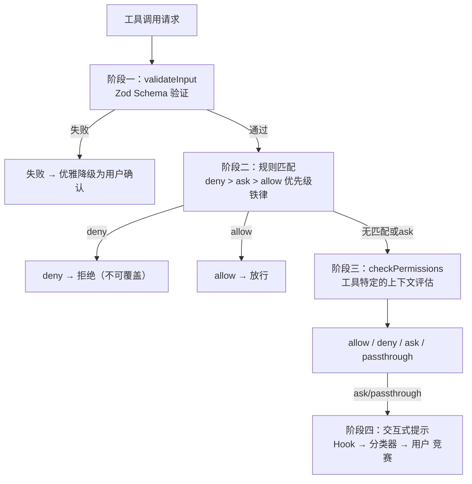
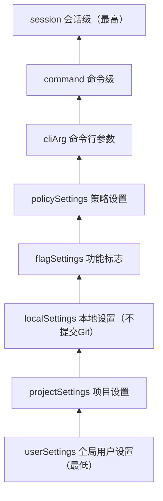
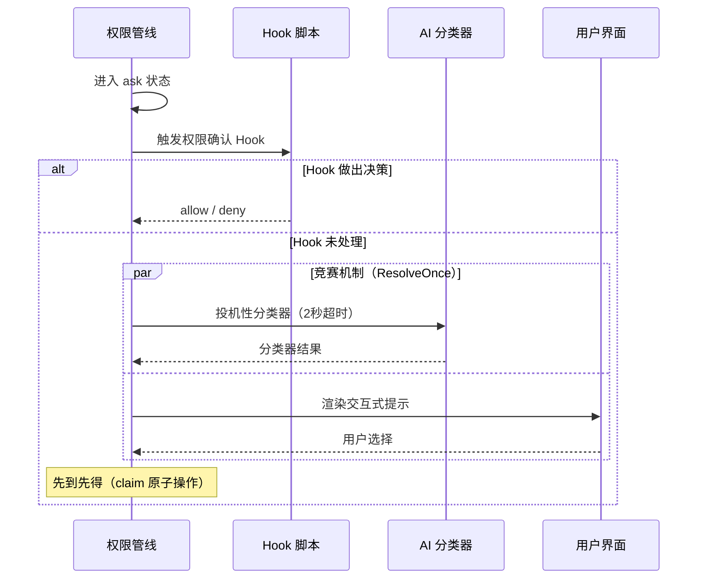
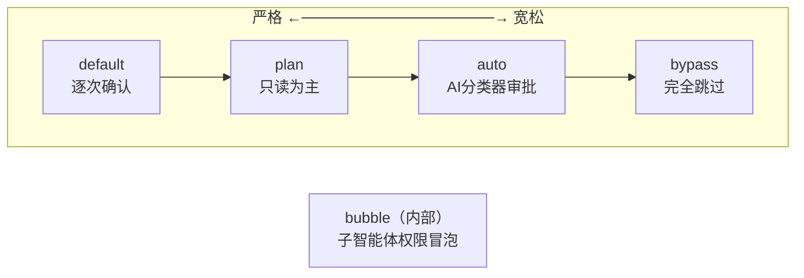
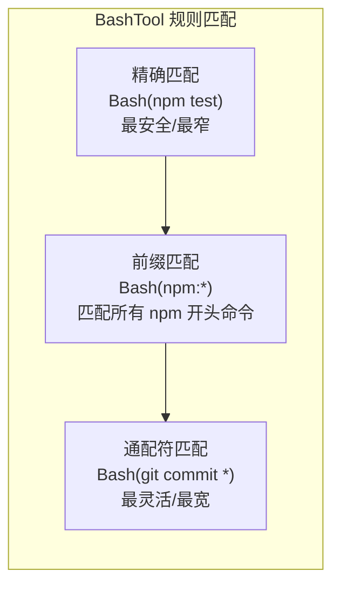
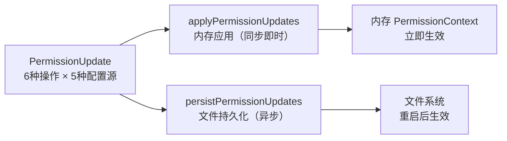

# 第 4 章：权限管线 — Agent 的护栏

> 本章对应《御舆》第 4 章，是第 1 章"安全边界内嵌"原则的完整展开。权限管线不是附加的安全层，而是被内嵌到架构核心管线中的四阶段纵深防御体系。

---

## 核心知识点一览

| 知识点 | 关键概念 | 与前文的联系 |
|--------|---------|-------------|
| 四阶段管线 | validateInput→规则匹配→checkPermissions→交互提示 | 第 1 章"安全边界内嵌"的具体管线 |
| 优先级铁律 | deny > ask > allow | 第 1 章"四阶段管线"第 1 步细化 |
| 五种权限模式 | default, plan, auto, bypass, bubble | 从严格到宽松的完整谱系 |
| BashTool 精细控制 | 精确匹配/前缀匹配/通配符匹配 | 第 3 章 BashTool 的权限维度 |
| 投机性分类器 | 2 秒 Promise.race | 第 2 章 AsyncGenerator 取消能力的应用 |
| ResolveOnce 原子竞争 | claim() 先到先得 | 第 1 章"不可变状态流转"的并发安全机制 |

---

## 4.1 四阶段权限管线

工具调用从 LLM 提出到最终执行，经过四个阶段。每阶段都可独立短路（做出终局决定），后续阶段不再执行。



### 阶段一：输入验证（validateInput）

管线的第一道关卡不是权限本身，而是数据合法性。工具输入经过 Zod Schema 严格解析，将"数据不合法"与"权限不足"区分开来。

```typescript
// 伪代码：阶段一
try {
  const parsed = tool.inputSchema.parse(rawInput);
  // 通过 → 进入阶段二
} catch (zodError) {
  // 失败 → 优雅降级为 ask（而非直接崩溃）
  return { behavior: "ask", reason: "输入验证失败" };
}
```

> **我的理解：** 验证失败时降级为 ask 而非直接拒绝，是"安全的错误处理"原则——让用户有机会决定是否继续，而不是替用户做决定。直接崩溃虽然暴露了问题，但在 Agent 运行时可能导致整个会话中断。

### 阶段二：规则匹配（hasPermissionsToUseTool）

按严格优先级顺序检查规则。核心铁律：**deny 始终优先于 allow，无论规则来源如何。**

```typescript
// 伪代码：规则匹配优先级
function matchRules(tool: Tool, input: Input, rules: PermissionRules) {
  // Step 1: 检查 deny 规则（最高优先级）
  if (matchesDenyRule(tool, input, rules)) return "deny";
  
  // Step 2: 检查 ask 规则
  if (matchesAskRule(tool, input, rules)) return "ask";
  
  // Step 3: 检查 allow 规则
  if (matchesAllowRule(tool, input, rules)) return "allow";
  
  // Step 4: 无匹配 → 进入阶段三
  return "no_match";
}
```

#### 七种规则来源（就近原则）



### 阶段三：上下文评估（checkPermissions）

每个工具可实现自定义的上下文评估。返回四种结果：

| 结果 | 含义 | 后续行为 |
|------|------|---------|
| `allow` | 放行，可携带 `updatedInput` | 直接执行 |
| `deny` | 拒绝 | 立即拒绝 |
| `ask` | 需要用户确认 | 进入阶段四 |
| `passthrough` | "我没有意见" | 进入阶段四（后续转为 ask） |

> **我的理解：** `passthrough` 和 `ask` 的微妙区别在于"意图"——`passthrough` 表示工具没有特殊权限逻辑，后续的 allow 规则可以覆盖它；而 `ask` 是工具显式要求用户确认，不会被覆盖。

### 阶段四：交互式提示（多决策者竞赛）

当管线到达 ask 状态时，三个决策者竞赛：



#### ResolveOnce 原子竞争

```typescript
class ResolveOnce<T> {
  private claimed = false;
  private resolved = false;
  private value: T | undefined;

  claim(): boolean {
    if (this.claimed) return false; // 已被占用
    this.claimed = true;            // 先到先得
    return true;
  }

  resolve(value: T): void {
    if (!this.claim()) return;      // 竞争失败，静默退出
    this.resolved = true;
    this.value = value;
  }
}
```

> **我的理解：** ResolveOnce 的设计像一张"单程机票"——一旦被某人兑换（claim），其他人就无法再使用。利用 JavaScript 单线程模型，`claim()` 天然是原子操作，不需要锁。这个轻量级互斥机制避免了分布式系统常见的锁开销。

---

## 4.2 五种权限模式谱系

从最严格到最宽松的完整谱系：



| 模式 | 行为 | 适用场景 | 安全等级 |
|------|------|---------|---------|
| `default` | 每次工具调用都需用户确认 | 日常交互式使用 | 最高 |
| `plan` | 写入工具 deny，只读放行 | 代码审查、架构分析 | 高 |
| `auto` | AI 分类器替代人工审批 | 半自动化开发 | 中 |
| `bypass` | 除 deny 规则和 safetyCheck 外全部放行 | CI/CD、受控环境 | 低 |
| `bubble` | 子智能体权限冒泡回主智能体（内部模式） | 多智能体协作 | 继承父级 |

### auto 模式的分类器优化

auto 模式使用"YOLO classifier"（AI 分类器）代替人工审批，但有多层优化减少 API 调用：

```typescript
// auto 模式权限检查流程
async function autoModeCheck(tool: Tool, input: Input) {
  // 优化 1：安全工具白名单 — 直接放行，不调分类器
  if (SAFE_TOOLS.includes(tool.name)) return "allow";
  // Read, Grep, Glob, TodoWrite 等只读/低风险工具
  
  // 优化 2：acceptEdits 快速路径 — 短路优化
  if (wouldPassInAcceptEditsMode(tool, input)) return "allow";
  
  // 优化 3：调用分类器
  const result = await classifier.check(tool, input, context);
  
  // 优化 4：拒绝追踪 — 连续拒绝多次后回退为人工确认（熔断器）
  if (consecutiveRejections > threshold) return "ask_user";
  
  return result;
}
```

> **我的理解：** auto 模式的"AI 监督 AI"架构很有趣——用一个小模型（分类器）来判断大模型（Agent）的操作是否安全。但某些安全检查是"分类器免疫"的（如 `.git/`、`.claude/` 目录操作），确保即使分类器判断失误也不会造成严重后果。

### bypass 模式的底线防护

即使 bypass 模式也无法突破以下防线：

1. deny 规则（在 bypass 检查之前执行）
2. `requiresUserInteraction` 检查
3. 内容级 ask 规则
4. safetyCheck 安全检查

---

## 4.3 BashTool 精细权限控制

Shell 命令的组合性和表达力远超其他工具——`git status` 安全，`git push --force origin main` 危险。权限系统需要理解命令语义。

### 三种匹配格式



### 配置示例

```json
{
  "permissions": {
    "allow": [
      "Bash(npm test)",           
      "Bash(npm run *)",          
      "Bash(git:*)",              
      "Read", "Glob", "Grep"     
    ],
    "deny": [
      "Bash(npm publish)",        
      "Bash(rm -rf *)",           
      "Bash(* > /etc/*)"          
    ]
  }
}
```

### 投机性分类器（2 秒 Promise.race）

```typescript
// 伪代码：分类器与超时竞赛
async function specularClassifierCheck(tool: Tool, input: Input) {
  const classifierPromise = classifier.check(tool, input);
  const timeoutPromise = sleep(2000).then(() => "timeout");
  
  const result = await Promise.race([classifierPromise, timeoutPromise]);
  
  if (result === "timeout") {
    // 分类器没来得及响应 → 回退为用户确认
    return "ask_user";
  }
  
  if (result.confidence > threshold) {
    return result.decision; // 高置信度 → 自动决策
  }
  
  return "ask_user"; // 低置信度 → 交给用户
}
```

> **我的理解：** 2 秒的超时是精心选择的"甜蜜点"——太短（500ms）可能因网络延迟导致分类器来不及响应，太长（10s）让用户等待太久。这种"尽力而为"策略确保分类器不会成为用户体验的瓶颈。

---

## 4.4 权限更新与持久化

### 双层更新机制



| 操作 | 说明 |
|------|------|
| addRules | 添加 allow/deny/ask 规则 |
| replaceRules | 替换规则 |
| removeRules | 移除规则 |
| setMode | 设置权限模式 |
| addDirectory | 添加额外工作目录 |
| removeDirectory | 移除目录 |

| 配置源 | 持久化支持 | 说明 |
|--------|-----------|------|
| userSettings | 是 | 全局用户设置 |
| projectSettings | 是 | 项目级（提交到 Git） |
| localSettings | 是 | 本地（不提交到 Git） |
| session | 否 | 仅当前会话 |
| cliArg | 否 | 仅本次运行 |

> **我的理解：** "内存优先、持久化异步"是高性能系统的通用模式——先确保内存状态正确（影响当前行为），然后异步写入持久存储（影响未来行为）。如果持久化失败，当前会话不受影响，但重启后规则会丢失。

### 团队协作最佳实践

```
.claude/
├── settings.json          # 团队共享 → 提交到 Git
│   └── 通用 allow/deny 规则（npm test, git:* 等）
├── settings.local.json    # 个人偏好 → .gitignore 排除
│   └── 个人习惯的额外放行规则
```

---

## 关键要点总结

1. **四阶段纵深防御** — validateInput → 规则匹配 → checkPermissions → 交互提示，每阶段可独立短路，没有单一"银弹"检查点。

2. **deny 优先级铁律** — deny 始终优先于 allow，即使在 bypass 模式下 deny 规则和 safetyCheck 仍然生效，确保安全策略不可妥协。

3. **PermissionContext 不可变** — 每次更新产生新对象，保证并发安全（多工具同时检查权限时各自读取独立快照）。

4. **ResolveOnce 先到先得** — 用户和分类器通过 claim() 原子操作竞争，轻量级互斥避免复杂锁管理。

5. **BashTool 三级匹配** — 精确→前缀→通配符，从窄到宽的表达能力谱系，配合 2 秒 Promise.race 投机性分类器。

6. **双层更新分离** — 内存应用同步即时 + 文件持久化异步，保证响应速度的同时支持跨会话持久化。

---

## 参考链接

- [本章原文：权限管线 — Agent 的护栏](https://github.com/lintsinghua/claude-code-book/blob/main/%E7%AC%AC%E4%B8%80%E9%83%A8%E5%88%86-%E5%9F%BA%E7%A1%80%E7%AF%87/04-%E6%9D%83%E9%99%90%E7%AE%A1%E7%BA%BF-Agent%E7%9A%84%E6%8A%A4%E6%A0%8F.md)
- [在线阅读](https://lintsinghua.github.io/)
- [上一篇：工具系统 — Agent 的双手](./agentic-loop-03)
- [下一篇：核心子系统 — 配置、记忆、上下文、钩子](./agentic-loop-05)
