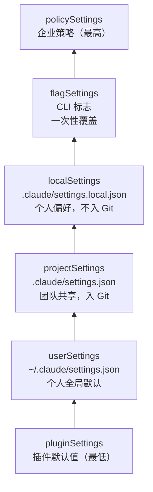
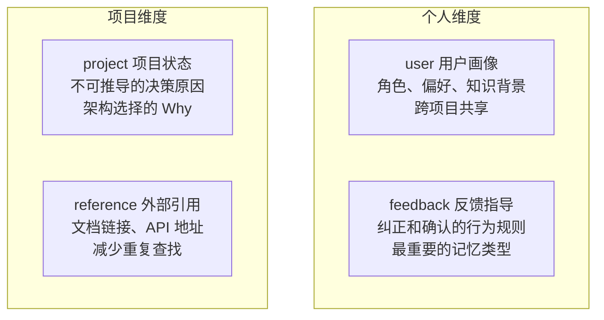
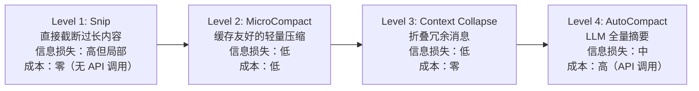
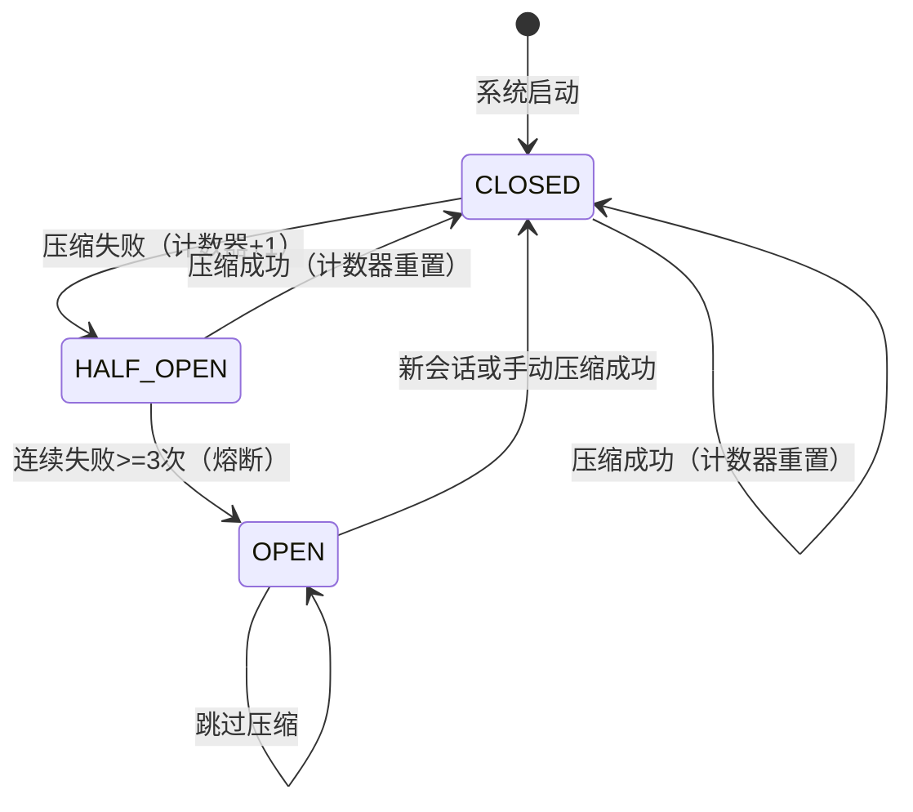
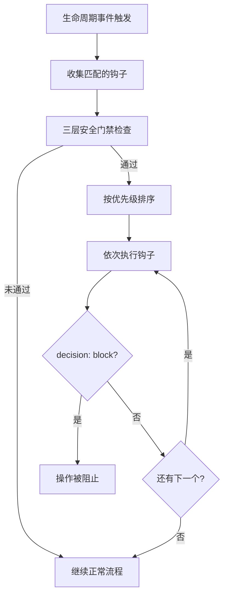

# 第 5-8 章：核心子系统 — 配置、记忆、上下文、钩子

> 本篇合并覆盖《御舆》第二部分（核心系统篇）的四个章节。如果说第一部分建立了 Agent Harness 的"骨架"（对话循环、工具系统、权限管线），第二部分则深入每个"器官"——配置是基因，记忆是长期存储，上下文是工作记忆，钩子是神经系统。

---

## 第 5 章：设置与配置 — Agent 的基因

### 知识点一览

| 概念 | 要点 |
|------|------|
| 六层配置优先级链 | plugin → user → project → local → flag → policy |
| 合并规则 | 数组拼接去重、对象深度合并、标量覆盖 |
| 安全边界 | 供应链攻击防御、受信工作区检查 |
| 双层功能门控 | 编译时 flag（tree-shaking）+ 运行时 flag |

### 六层配置优先级链



核心原则：**后加载者覆盖前者**。但不是全量替换，而是深度合并。

### 合并规则伪代码

```typescript
function settingsMergeCustomizer(objValue: any, srcValue: any) {
  if (Array.isArray(objValue) && Array.isArray(srcValue)) {
    return uniq([...objValue, ...srcValue]); // 数组拼接去重
  }
  // 对象类型 → 深度合并（默认行为）
  // 标量类型 → 后者覆盖前者（默认行为）
}
```

> **我的理解：** 数组用拼接而非替换，是因为权限规则中每条规则都是一道"防线"——如果高优先级源替换了低优先级源的数组，高优先级源就必须完整枚举所有规则，遗漏即漏洞。拼接让每层只需关心自己要"增加"的规则。

### 供应链攻击防御

```
攻击向量：恶意项目在 .claude/settings.json 中注入危险的 allow 规则
防御机制：
1. projectSettings 的权限规则受"受信工作区"检查约束
2. 首次打开包含 .claude/settings.json 的项目时需用户确认信任
3. deny 规则始终优先于 allow（即使 allow 来自更高优先级源）
```

### 双层功能门控

```typescript
// 编译时 flag — bundler 评估，支持 tree-shaking
if (process.env.INTERNAL_BUILD === "true") {
  // 内部工具代码，外部构建中被完全移除
}

// 运行时 flag — 动态判断，支持 A/B 测试
if (featureFlags.get("streaming_tool_execution")) {
  // 使用 StreamingToolExecutor
} else {
  // 回退到批量执行
}
```

---

## 第 6 章：记忆系统 — Agent 的长期记忆

### 知识点一览

| 概念 | 要点 |
|------|------|
| 四种封闭式记忆类型 | user, feedback, project, reference |
| 核心原则 | "只保存无法推导的信息" |
| MEMORY.md 索引 | 每个目录一个索引文件，链接到具体记忆条目 |
| Fork 记忆机制 | 子智能体继承父级记忆的只读快照 |

### 四种记忆类型



| 类型 | 存储什么 | 不存储什么 | 示例 |
|------|---------|-----------|------|
| `user` | 角色、偏好、知识背景 | 可推导的技术栈 | "用户写了十年 Go，React 新手" |
| `feedback` | 行为纠正 + 成功确认 | 一次性指令 | "提交前必须运行 lint" |
| `project` | 决策原因（Why） | 代码结构（What） | "选 SQLite 因为嵌入式部署需求" |
| `reference` | 文档链接、API 地址 | 可搜索到的内容 | "内部 API 文档在 wiki.corp/api" |

> **我的理解：** "只保存不可推导的信息"是个绝佳的记忆设计原则。代码模式、文件结构、Git 历史都可以通过工具实时获取，不需要记忆。记忆应该保存的是"为什么"而非"是什么"——比如"为什么选了 SQLite"而非"项目用了 SQLite"（后者 grep 一下就知道了）。

### 记忆文件结构

```
~/.claude/                       # 用户全局记忆
├── MEMORY.md                    # 索引文件
└── memories/
    ├── user-profile.md          # user 类型
    └── general-feedback.md      # feedback 类型

/project/.claude/                # 项目级记忆
├── MEMORY.md                    # 索引文件
└── memories/
    ├── project-architecture.md  # project 类型
    └── api-references.md        # reference 类型
```

### Fork 记忆继承

```typescript
// 子智能体创建时继承父级记忆的只读快照
const subagentMemory = {
  ...parentMemory,    // 继承所有记忆
  readonly: true,     // 但不可修改
  // 子智能体的新记忆不会回写到父级
};
```

---

## 第 7 章：上下文管理 — Agent 的工作记忆

### 知识点一览

| 概念 | 要点 |
|------|------|
| 有效窗口公式 | `有效窗口 = 模型窗口 - 预留输出令牌` |
| 四级渐进压缩 | Snip → MicroCompact → Collapse → AutoCompact |
| 断路器模式 | 连续失败 3 次后熔断，不再尝试 |
| 阈值体系 | 85% 警告 → 90% 自动压缩 → 95% 阻塞 |

### 有效窗口公式

```
有效窗口 = 模型窗口 - min(最大输出令牌, 20000)

示例（200K 窗口模型）：
有效窗口 = 200,000 - min(16,384, 20,000) = 183,616 令牌
```

> **我的理解：** 为什么预留 20,000 令牌？因为 AutoCompact 需要调用 LLM 生成摘要，摘要本身消耗输出令牌。如果不预留空间，压缩操作本身可能因为输出空间不足而失败——这是一个经典的"压缩悖论"。

### 四级渐进压缩策略

核心原则：**从轻到重，延迟最激进的手段。** 每步都先尝试最小代价方案，因为每步都会丢失一些信息。



| 级别 | 策略 | 触发条件 | 信息损失 | API 成本 |
|------|------|---------|---------|---------|
| 1 | **Snip** | 工具结果超长 | 高但局部 | 零 |
| 2 | **MicroCompact** | 常规预处理 | 低（缓存友好） | 低 |
| 3 | **Context Collapse** | 连续冗余消息 | 低 | 零 |
| 4 | **AutoCompact** | 令牌超 90% 阈值 | 中（全量摘要） | 高 |

### 断路器模式



> **我的理解：** 断路器是对"盲目重试"反模式的优雅解决。如果压缩失败是因为 API 暂时不可用，盲目重试会在每个 Turn 都浪费一次 API 调用。断路器让系统在检测到持续性失败后快速跳过，等到条件改善时再恢复。

### 四区阈值体系

```
0%──────85%──────90%──────95%──────100%
  安全区域  │ 警告区域 │ 压缩区域 │ 阻塞区域
           WARNING  AUTOCOMPACT  BLOCKING
```

---

## 第 8 章：钩子系统 — Agent 的生命周期扩展点

### 知识点一览

| 概念 | 要点 |
|------|------|
| 五种 Hook 类型 | Command, Prompt, Agent, HTTP, Function |
| 26 个生命周期事件 | PreToolUse, PostToolUse, Notification 等 |
| JSON 响应协议 | decision, updatedInput, additionalContext |
| 三层安全机制 | 全局禁用 → 仅托管钩子 → 工作区信任检查 |
| 六层优先级 | user > project > local > plugin > ... |

### 五种钩子类型对比

| 类型 | 执行引擎 | 可持久化 | 延迟 | 典型场景 |
|------|---------|---------|------|---------|
| **Command** | Shell 命令 | 是 | 毫秒级 | 脚本检查、lint |
| **Prompt** | LLM 推理 | 是 | 秒级 | 内容审核 |
| **Agent** | LLM 多步 | 是 | 秒~分钟 | 测试验证 |
| **HTTP** | HTTP 请求 | 是 | 网络依赖 | CI 集成、审计日志 |
| **Function** | TS 回调 | 否 | 毫秒级 | 运行时拦截 |

### 钩子执行流程



### JSON 响应协议

钩子通过 stdout 输出 JSON 来控制 Agent 行为：

```typescript
interface HookResponse {
  decision?: "allow" | "block" | "skip";  // 控制操作是否继续
  reason?: string;                         // 决策原因（展示给用户）
  updatedInput?: Record<string, any>;      // 修改工具输入参数
  additionalContext?: string;              // 注入额外上下文给模型
}
```

### 三层安全机制

```
第一层：全局禁用 — CLI --disable-hooks 完全关闭钩子系统
第二层：仅托管钩子 — 只允许运行托管环境提供的钩子，禁止用户自定义
第三层：工作区信任检查 — 项目级钩子需要用户确认信任
```

> **我的理解：** 钩子系统的设计体现了"观察者模式 + 责任链模式"的组合。每个生命周期事件是一个信号，多个钩子按优先级依次处理，任何一个都可以阻断信号传播。这实现了核心引擎与用户自定义逻辑的彻底解耦——核心引擎不需要知道有哪些扩展存在。

### 钩子配置示例

```json
{
  "hooks": {
    "PreToolUse": [
      {
        "type": "command",
        "matcher": "Bash",
        "command": "node scripts/check-bash-safety.js",
        "timeout": 5000
      }
    ],
    "PostToolUse": [
      {
        "type": "command",
        "matcher": "FileWriteTool",
        "command": "npx eslint --fix ${file}",
        "timeout": 10000
      }
    ]
  }
}
```

---

## 文件结构参考（Part 2 核心子系统）

```
src/
├── config/
│   ├── settings.ts            # 六层配置加载与合并
│   ├── settingsMerge.ts       # 合并策略（数组拼接、深度合并）
│   ├── featureFlags.ts        # 双层功能门控
│   └── trustCheck.ts          # 工作区信任检查
├── memory/
│   ├── memdir.ts              # 记忆目录管理
│   ├── types.ts               # 四种记忆类型定义
│   ├── index.ts               # MEMORY.md 索引生成
│   └── autoExtract.ts         # 自动记忆提取
├── context/
│   ├── autocompact.ts         # AutoCompact 全量摘要
│   ├── microcompact.ts        # MicroCompact 缓存友好压缩
│   ├── snip.ts                # Snip 截断压缩
│   ├── contextCollapse.ts     # Context Collapse 折叠
│   ├── circuitBreaker.ts      # 断路器模式
│   └── tokenCounter.ts        # 令牌计数与阈值检查
└── hooks/
    ├── hookRunner.ts          # 钩子执行引擎
    ├── hookSchema.ts          # 五种钩子类型 Schema
    ├── security.ts            # 三层安全门禁
    └── events.ts              # 26 个生命周期事件定义
```

---

## 关键要点总结

1. **配置是分层累积的** — 六层配置源遵循"后加载者覆盖前者"，但数组类型是拼接而非替换，确保每层安全规则都被保留。

2. **记忆只保存不可推导的信息** — 四种封闭式类型覆盖用户画像、行为反馈、项目决策、外部引用，避免存储可通过工具实时获取的信息。

3. **上下文压缩从轻到重** — Snip → MicroCompact → Collapse → AutoCompact 四级渐进策略，断路器防止压缩失败的级联影响。

4. **钩子是非侵入式扩展** — 五种类型覆盖从脚本到 AI 推理的完整能力谱系，26 个生命周期事件提供精细的控制点，三层安全机制防止恶意钩子。

---

## 参考链接

- [Ch05 原文：设置与配置](https://github.com/lintsinghua/claude-code-book/blob/main/%E7%AC%AC%E4%BA%8C%E9%83%A8%E5%88%86-%E6%A0%B8%E5%BF%83%E7%B3%BB%E7%BB%9F%E7%AF%87/05-%E8%AE%BE%E7%BD%AE%E4%B8%8E%E9%85%8D%E7%BD%AE-Agent%E7%9A%84%E5%9F%BA%E5%9B%A0.md)
- [Ch06 原文：记忆系统](https://github.com/lintsinghua/claude-code-book/blob/main/%E7%AC%AC%E4%BA%8C%E9%83%A8%E5%88%86-%E6%A0%B8%E5%BF%83%E7%B3%BB%E7%BB%9F%E7%AF%87/06-%E8%AE%B0%E5%BF%86%E7%B3%BB%E7%BB%9F-Agent%E7%9A%84%E9%95%BF%E6%9C%9F%E8%AE%B0%E5%BF%86.md)
- [Ch07 原文：上下文管理](https://github.com/lintsinghua/claude-code-book/blob/main/%E7%AC%AC%E4%BA%8C%E9%83%A8%E5%88%86-%E6%A0%B8%E5%BF%83%E7%B3%BB%E7%BB%9F%E7%AF%87/07-%E4%B8%8A%E4%B8%8B%E6%96%87%E7%AE%A1%E7%90%86-Agent%E7%9A%84%E5%B7%A5%E4%BD%9C%E8%AE%B0%E5%BF%86.md)
- [Ch08 原文：钩子系统](https://github.com/lintsinghua/claude-code-book/blob/main/%E7%AC%AC%E4%BA%8C%E9%83%A8%E5%88%86-%E6%A0%B8%E5%BF%83%E7%B3%BB%E7%BB%9F%E7%AF%87/08-%E9%92%A9%E5%AD%90%E7%B3%BB%E7%BB%9F-Agent%E7%9A%84%E7%94%9F%E5%91%BD%E5%91%A8%E6%9C%9F%E6%89%A9%E5%B1%95%E7%82%B9.md)
- [在线阅读](https://lintsinghua.github.io/)
- [上一篇：权限管线 — Agent 的护栏](./agentic-loop-04)
- [下一篇：高级模式 — 子智能体、编排、技能与 MCP](./agentic-loop-06)
