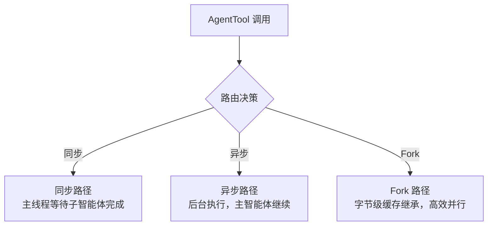
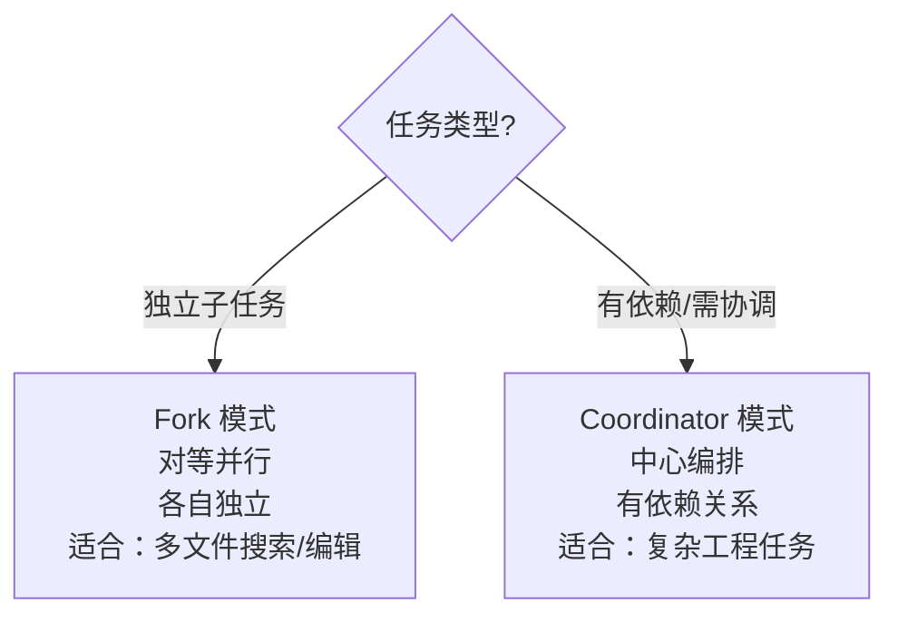
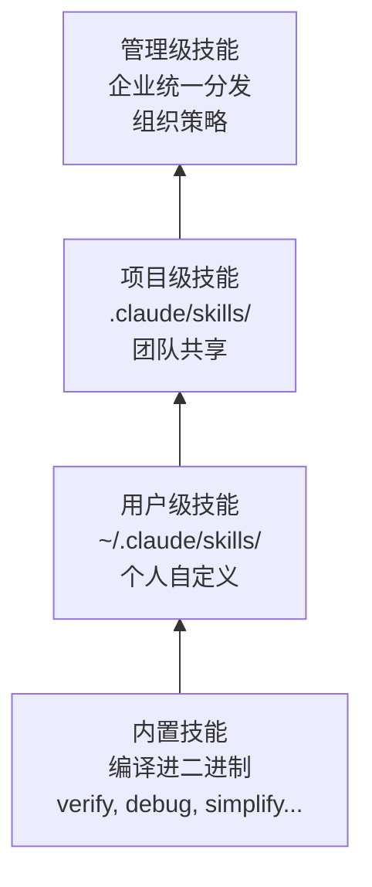
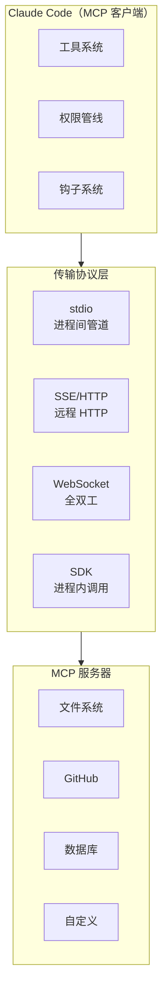
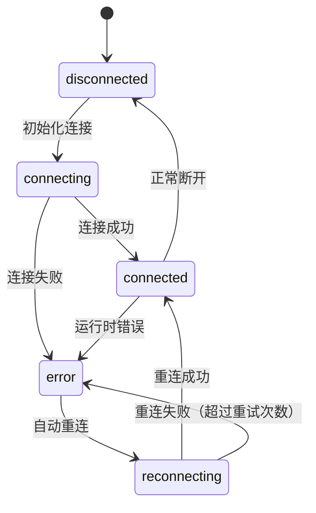

# 第 9-12 章：高级模式 — 子智能体、编排、技能与 MCP

> 本篇合并覆盖《御舆》第三部分（高级模式篇）。如果前两部分是理解 Agent "一个人怎么工作"，第三部分则是理解 Agent "怎么组团合作"以及"怎么连接外部世界"。这也是第 1 章中"渐进式能力扩展"原则的完整落地。

---

## 第 9 章：子智能体与 Fork 模式

### 知识点一览

| 概念 | 要点 |
|------|------|
| 三种 Agent 来源 | 内置 Agent、自定义 Agent、MCP Agent |
| 四种内置 Agent | 代码搜索、文件编辑、验证、对抗性验证 |
| Fork 模式 | 字节级上下文继承，缓存共享 |
| 递归 Fork 防护 | 最大深度限制，防止无限嵌套 |

### AgentTool 架构

```
agent/
├── AgentTool.ts         # 工具主入口（路由决策）
├── agentRunner.ts       # 智能体运行器（生命周期管理）
├── forkMode.ts          # Fork 模式（缓存安全消息前缀）
├── builtinAgents.ts     # 内置智能体注册表
├── customAgents.ts      # 自定义智能体加载（Markdown/JSON）
└── utils.ts             # 工具过滤、解析、结果格式化
```

### 三种执行路径



### Fork 模式的缓存共享策略

Fork 模式的核心优势是**缓存共享**——子智能体不需要重新发送已被 API 缓存的上下文。

```typescript
// Fork 创建伪代码
function createFork(parentContext: Context, task: string) {
  return {
    // 继承父级的系统提示（字节级一致 → 命中缓存）
    systemPrompt: parentContext.renderedSystemPrompt,

    // 继承父级的消息历史前缀（保证缓存连续性）
    messagePrefix: buildCacheSafePrefix(parentContext.messages),

    // 独立的消息空间（子智能体的新对话）
    newMessages: [{ role: "user", content: task }],

    // 继承但不共享的权限（bubble 模式）
    permissionMode: "bubble",

    // 递归深度 +1
    forkDepth: parentContext.forkDepth + 1,
  };
}
```

> **我的理解：** Fork 模式的精妙之处在于它把子智能体的启动成本降到了几乎为零。传统方式下每个子智能体都要从头发送系统提示和上下文，消耗大量 token。Fork 通过确保系统提示和消息前缀与父级字节级一致，让 API 侧的 Prompt 缓存自动命中。这是第 1 章"缓存感知设计"原则在多智能体场景的极致体现。

### 四种内置 Agent

| Agent | 职责 | 工具集 | 设计意图 |
|-------|------|--------|---------|
| 代码搜索 Agent | 搜索和分析代码 | Read, Grep, Glob（只读） | 隔离搜索上下文 |
| 文件编辑 Agent | 编辑文件 | Read, Edit, Write | 隔离编辑任务 |
| 验证 Agent | 验证代码正确性 | Read, Bash, Grep | 独立验证 |
| 对抗性验证 Agent | 从对立角度审查 | Read, Bash, Grep | "红队"思维 |

> **我的理解：** 对抗性验证 Agent 的设计特别有趣——它的系统提示要求从"找错"的角度审查代码，而非"验证正确"。这是一种内建的"红队"机制，类似代码审查中让一个人专门负责挑毛病。

---

## 第 10 章：协调器模式 — 多智能体编排

### 知识点一览

| 概念 | 要点 |
|------|------|
| Coordinator-Worker 架构 | 中心化编排，一个协调者管理多个工作者 |
| 双重门控 | 编译时 Feature Gate + 运行时环境变量 |
| "只编排不执行"约束 | 协调者不直接调用业务工具 |
| 四种寻址模式 | 直接指名、类型匹配、能力匹配、广播 |
| Scratchpad 协作空间 | 工作者之间的共享存储 |

### Coordinator vs Fork 选型



| 维度 | Fork 模式 | Coordinator 模式 |
|------|----------|-----------------|
| 架构 | 对等并行 | 中心化编排 |
| 通信 | 无（独立上下文） | 通过 Scratchpad |
| 依赖管理 | 不支持 | 支持 |
| 适用场景 | 独立并行任务 | 有依赖的复杂工程 |
| 开销 | 低（缓存共享） | 中（协调逻辑） |

### "只编排不执行" 约束

```typescript
// 协调者的工具集
const coordinatorTools = [
  "AgentTool",        // 委派任务给工作者
  "TodoWriteTool",    // 管理任务列表
  "Read",             // 只读理解（不修改）
  "Grep", "Glob",     // 搜索理解（不修改）
  // 注意：没有 Edit, Write, Bash！
];
// 协调者不直接执行业务操作，只通过 AgentTool 委派给工作者
```

> **我的理解：** "只编排不执行"是一个关键的架构约束。如果协调者既编排又执行，它会成为系统瓶颈（所有任务都串行经过它）和单点故障（它的错误影响所有任务）。通过限制协调者只能使用 AgentTool 委派任务，系统自然具备了并行能力和故障隔离。

### 四阶段工作流


---

## 第 11 章：技能系统与插件架构

### 知识点一览

| 概念 | 要点 |
|------|------|
| 11 个核心技能 | verify, debug, simplify, batch, stuck 等 |
| SKILL.md frontmatter | 声明式技能定义格式 |
| 三级参数替换 | 位置参数、命名参数、上下文变量 |
| 分层加载 | 用户级 → 项目级 → 管理级 |
| 插件缓存优先加载 | 本地缓存 → 远程拉取 |

### 技能系统分层



### SKILL.md 声明式定义

```markdown
---
name: code-review
description: 执行代码审查
tags: [review, quality]
arguments:
  - name: file
    description: 要审查的文件路径
    required: true
  - name: focus
    description: 审查关注点
    required: false
    default: "all"
---

# Code Review

请对 {{file}} 进行代码审查，关注点是 {{focus}}。

检查以下方面：
1. 代码逻辑正确性
2. 错误处理完整性
3. 性能问题
4. 安全漏洞
```

> **我的理解：** 技能系统是"渐进式能力扩展"的完美体现——最简单的需求只需要一个 SKILL.md 文件，复杂需求可以用 TypeScript 编写内置技能。每种扩展方式有不同的能力上限，但入门门槛也不同。这让不同角色的贡献者都能在最适合自己的抽象层次上工作。

---

## 第 12 章：MCP 集成与外部协议

### 知识点一览

| 概念 | 要点 |
|------|------|
| 8 种传输协议 | stdio, SSE, HTTP, WebSocket, SDK 等 |
| 五态连接管理 | disconnected → connecting → connected → error → reconnecting |
| 三段式工具命名 | `mcp__{serverName}__{toolName}` |
| Bridge 双向通信 | SSE 序列号延续、多会话安全 |
| 七层配置作用域 | 全局 → 项目 → 本地 → ... |

### MCP 架构总览



### 五态连接生命周期



### 三段式工具命名

```typescript
// MCP 工具在 Claude Code 中的命名规则
const toolName = `mcp__${serverName}__${originalToolName}`;

// 示例
"mcp__github__create_issue"     // GitHub 服务器的 create_issue 工具
"mcp__postgres__query"          // Postgres 服务器的 query 工具
"mcp__filesystem__read_file"    // 文件系统服务器的 read_file 工具
```

权限规则也支持 MCP 工具的通配符匹配：

```json
{
  "permissions": {
    "allow": ["mcp__github__*"],
    "deny": ["mcp__postgres__drop_table"]
  }
}
```

### 8 种传输协议选型

| 协议 | 适用场景 | 延迟 | 复杂度 |
|------|---------|------|--------|
| **stdio** | 本地进程，最常用 | 最低 | 低 |
| **SSE** | 远程 HTTP 服务器 | 中 | 中 |
| **HTTP Streamable** | 现代 HTTP 流式 | 中 | 中 |
| **WebSocket** | 全双工实时通信 | 低 | 高 |
| **SDK (in-process)** | 进程内调用 | 最低 | 低 |
| **Docker** | 容器化隔离 | 中 | 高 |
| **npx** | npm 包即用即走 | 首次高 | 低 |
| **uvx** | Python 包即用即走 | 首次高 | 低 |

> **我的理解：** MCP 是 Agent 从"封闭系统"变为"开放平台"的关键。没有 MCP，Agent 的能力边界由开发者预设；有了 MCP，Agent 可以在运行时动态发现和调用外部工具。三段式命名确保了跨服务器的工具不会冲突，而权限规则的通配符支持让管理大量 MCP 工具变得可行。

---

## 文件结构参考（Part 3 高级模式）

```
src/
├── agent/
│   ├── AgentTool.ts             # 工具入口 + 路由
│   ├── agentRunner.ts           # 生命周期管理
│   ├── forkMode.ts              # Fork 缓存策略
│   ├── builtinAgents/           # 内置智能体
│   │   ├── codeSearch.ts
│   │   ├── fileEdit.ts
│   │   ├── verify.ts
│   │   └── adversarialVerify.ts
│   └── customAgents/            # 自定义智能体加载
├── coordinator/
│   ├── coordinatorMode.ts       # 协调器核心（~370行）
│   ├── scratchpad.ts            # 工作者共享存储
│   └── taskRouter.ts            # 任务分配与寻址
├── skills/
│   ├── bundledSkills.ts         # 内置技能注册
│   ├── skillLoader.ts           # SKILL.md 解析
│   ├── paramSubstitution.ts     # 三级参数替换
│   └── userSkills/              # 用户自定义技能目录
├── plugins/
│   ├── pluginLoader.ts          # 插件加载与缓存
│   └── pluginSandbox.ts         # 插件安全沙盒
└── mcp/
    ├── mcpClient.ts             # MCP 客户端
    ├── transport/               # 8 种传输协议实现
    │   ├── stdio.ts
    │   ├── sse.ts
    │   ├── websocket.ts
    │   └── sdk.ts
    ├── toolMapping.ts           # 三段式工具命名映射
    ├── connectionManager.ts     # 五态连接管理
    └── bridge.ts                # Bridge 双向通信
```

---

## 关键要点总结

1. **Fork 模式是缓存感知的并行化** — 通过字节级继承父级上下文，让 API 缓存自动命中，将子智能体启动成本降到几乎为零。

2. **Coordinator 模式"只编排不执行"** — 协调者只有 AgentTool 和只读工具，通过委派实现并行和故障隔离。

3. **技能系统零配置可用** — 从 SKILL.md 声明式定义到 TypeScript 内置技能，不同角色的贡献者有不同的扩展入口。

4. **MCP 让 Agent 成为开放平台** — 通过标准化协议动态发现和调用外部工具，三段式命名避免冲突，权限通配符支持规模化管理。

---

## 参考链接

- [Ch09 原文：子智能体与 Fork 模式](https://github.com/lintsinghua/claude-code-book/blob/main/%E7%AC%AC%E4%B8%89%E9%83%A8%E5%88%86-%E9%AB%98%E7%BA%A7%E6%A8%A1%E5%BC%8F%E7%AF%87/09-%E5%AD%90%E6%99%BA%E8%83%BD%E4%BD%93%E4%B8%8EFork%E6%A8%A1%E5%BC%8F.md)
- [Ch10 原文：协调器模式](https://github.com/lintsinghua/claude-code-book/blob/main/%E7%AC%AC%E4%B8%89%E9%83%A8%E5%88%86-%E9%AB%98%E7%BA%A7%E6%A8%A1%E5%BC%8F%E7%AF%87/10-%E5%8D%8F%E8%B0%83%E5%99%A8%E6%A8%A1%E5%BC%8F-%E5%A4%9A%E6%99%BA%E8%83%BD%E4%BD%93%E7%BC%96%E6%8E%92.md)
- [Ch11 原文：技能系统与插件架构](https://github.com/lintsinghua/claude-code-book/blob/main/%E7%AC%AC%E4%B8%89%E9%83%A8%E5%88%86-%E9%AB%98%E7%BA%A7%E6%A8%A1%E5%BC%8F%E7%AF%87/11-%E6%8A%80%E8%83%BD%E7%B3%BB%E7%BB%9F%E4%B8%8E%E6%8F%92%E4%BB%B6%E6%9E%B6%E6%9E%84.md)
- [Ch12 原文：MCP 集成与外部协议](https://github.com/lintsinghua/claude-code-book/blob/main/%E7%AC%AC%E4%B8%89%E9%83%A8%E5%88%86-%E9%AB%98%E7%BA%A7%E6%A8%A1%E5%BC%8F%E7%AF%87/12-MCP%E9%9B%86%E6%88%90%E4%B8%8E%E5%A4%96%E9%83%A8%E5%8D%8F%E8%AE%AE.md)
- [在线阅读](https://lintsinghua.github.io/)
- [上一篇：核心子系统 — 配置、记忆、上下文、钩子](./agentic-loop-05)
- [下一篇：工程实践 — 流式架构、Plan 模式与构建指南](./agentic-loop-07)
