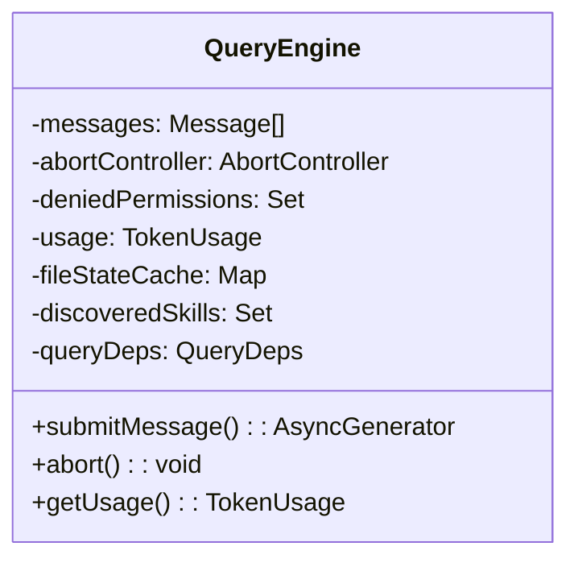
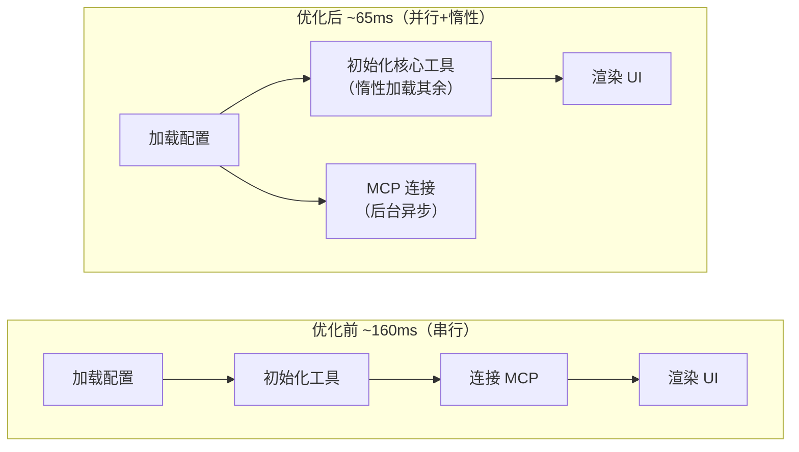
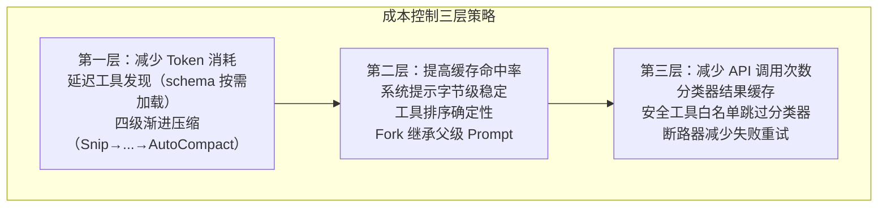
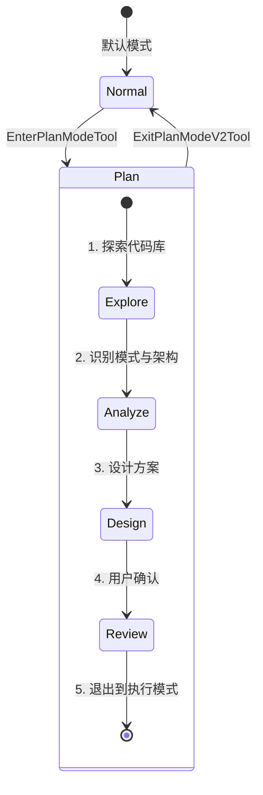
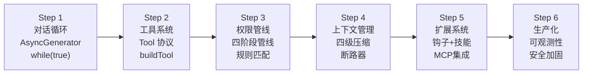
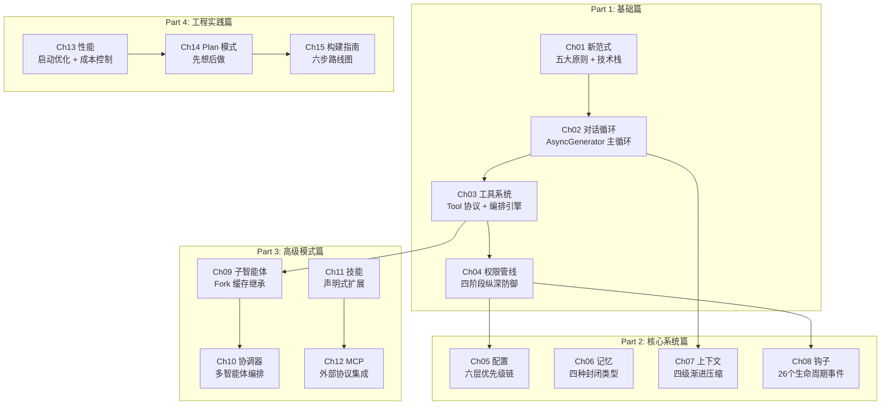

# 第 13-15 章：工程实践 — 流式架构、Plan 模式与构建指南

> 本篇合并覆盖《御舆》第四部分（工程实践篇）。前三部分是"理解架构"，第四部分是"从原理到构建"——包括性能优化的工程细节、Plan 模式的结构化工作流，以及从零构建一个完整 Agent Harness 的实战路线图。

---

## 第 13 章：流式架构与性能优化

### 知识点一览

| 概念 | 要点 |
|------|------|
| QueryEngine 生命周期 | 一个会话一个实例，状态在 turn 间持久 |
| 并发控制 | 单线程 + AbortController + 层级取消信号 |
| 启动优化 | 160ms → 65ms（-59%）通过并行预取和惰性加载 |
| Prompt 缓存优化 | 系统提示稳定性 + 工具排序确定性 |
| 成本控制 | 延迟工具发现 + 缓存感知压缩 |

### QueryEngine：查询生命周期管理者



为什么引入 Class 而非纯函数？因为会话状态的复杂性——如果把消息历史、文件缓存、用量统计等作为参数传递，调用链会极为脆弱。Class 将状态封装为实例属性，新增状态只需在构造函数中初始化，不破坏现有接口。

> **我的理解：** 这看似与第 2 章"对话循环选择函数式"矛盾。其实不然——`QueryEngine`（Class）负责跨 Turn 的会话级状态管理，而 `queryLoop`（函数式生成器）负责单 Turn 内的不可变状态流转。两者在不同粒度上各取所长。

### 启动优化时序



关键优化策略：

| 策略 | 做法 | 效果 |
|------|------|------|
| **并行预取** | 配置加载与 MCP 连接并行 | 消除等待时间 |
| **惰性加载** | 工具按需加载，不在启动时全部初始化 | 减少启动模块数 |
| **动态导入** | `import()` 替代静态 `import` | 避免循环依赖 + 减少初始加载量 |
| **Prompt 缓存稳定性** | 工具列表按名称排序 | 确保每次 API 调用的 Prompt 字节一致 |

### 成本控制策略总结



---

## 第 14 章：Plan 模式与结构化工作流

### 知识点一览

| 概念 | 要点 |
|------|------|
| "先想后做"哲学 | 只读探索→可写执行的两阶段分离 |
| 模式切换 | EnterPlanModeTool / ExitPlanModeV2Tool |
| 计划文件三层恢复 | 会话级暂存 → 文件级持久化 → Git 级版本控制 |
| 本地调度与远程触发 | Cron 定时任务 + RemoteTrigger 外部触发 |

### "先想后做"的工程价值

Plan 模式解决的核心问题是 **"过早行动"（Premature Action）**。

| 场景 | 无 Plan 模式 | 有 Plan 模式 |
|------|-------------|-------------|
| 误解需求 | 直接实现错误功能，需回滚 | 在只读阶段发现误解，零成本修正 |
| 忽略已有模式 | 写出与项目风格不一致的代码 | 先探索项目发现既有模式，再实施 |
| 方案选择失误 | 实现了性能差的方案，需重写 | 对比多个方案的 trade-off 后再动手 |
| 遗漏边界情况 | 代码写完才发现遗漏，返工 | 在规划中枚举边界情况并纳入方案 |

### 模式切换状态机



Plan 模式下的行为约束：

```typescript
// Plan 模式下的工具限制
const planModeTools = {
  allowed: ["Read", "Grep", "Glob", "WebSearch", "WebFetch"],
  denied: ["Edit", "Write", "Bash"],
  // Agent 可以自由探索但不能修改任何东西
};
```

> **我的理解：** Plan 模式就像建筑行业的"先画图纸再施工"。改一张图纸比拆一面墙便宜得多。在 Agent 场景中，Plan 模式让"纠正方向性错误"的代价几乎为零，因为探索阶段不产生任何副作用。

### 计划文件三层恢复策略

```
第一层：会话级暂存
  → 计划存在内存中，会话结束即丢失
  → 适用于短期探索

第二层：文件级持久化
  → 计划保存为 .plan.md 文件
  → 跨会话恢复，适用于多天任务

第三层：Git 级版本控制
  → 计划文件纳入版本控制
  → 团队共享和协作审查
```

---

## 第 15 章：构建你自己的 Agent Harness

### 知识点一览

| 概念 | 要点 |
|------|------|
| 五大设计原则回顾 | 循环优于递归、Schema 驱动、渐进式权限、流式优先、可插拔扩展 |
| 六步实现路线图 | 循环→工具→权限→上下文→扩展→生产化 |
| 循环依赖解决 | 动态导入 + 接口解耦 |
| 四层可观测性 | 日志→指标→追踪→告警 |
| 安全威胁模型 | Prompt 注入、工具滥用、数据泄露 |

### 五大设计原则的工程映射

| 原则 | 工程决策 | 反模式 |
|------|---------|--------|
| 循环优于递归 | `while(true)` + `continue` | 递归调用导致栈溢出 |
| Schema 驱动 | Zod Schema → 验证 + 文档 + 权限 | 手动编写验证逻辑 |
| 渐进式权限 | 四阶段管线，每阶段可短路 | 单一 boolean 检查 |
| 流式优先 | AsyncGenerator + yield | 等待完整响应再处理 |
| 可插拔扩展 | 钩子 + 技能 + MCP | 修改核心代码添加功能 |

### 六步实现路线图



### 最小可行 Agent 骨架

```typescript
// Step 1: 最小对话循环
async function* agentLoop(
  userMessage: string,
  tools: Tool[],
  deps: AgentDeps,
): AsyncGenerator<AgentEvent, Terminal> {
  const messages: Message[] = [
    { role: "user", content: userMessage },
  ];

  while (true) {
    // 1. 调用 LLM
    const response = yield* deps.callModel({
      messages,
      tools: tools.map(t => t.toAPISchema()),
    });

    // 2. 收集助手消息
    messages.push({ role: "assistant", content: response.content });
    yield { type: "assistant_message", message: response };

    // 3. 检查是否有工具调用
    const toolCalls = response.content.filter(
      block => block.type === "tool_use"
    );

    if (toolCalls.length === 0) {
      return { reason: "completed" }; // 无工具调用 → 完成
    }

    // 4. 执行工具（简化版，无并发分区）
    for (const call of toolCalls) {
      const tool = tools.find(t => t.name === call.name);
      const result = await tool.call(call.input);
      messages.push({
        role: "user",
        content: [{ type: "tool_result", tool_use_id: call.id, content: result }],
      });
      yield { type: "tool_result", result };
    }

    // 5. continue → 下一轮循环
  }
}
```

> **我的理解：** 这个最小骨架只有 ~40 行，但已经包含了 Agent 的核心模式：`while(true)` 循环、LLM 调用、工具检测、工具执行、结果回填。后续的所有复杂性（并发分区、权限管线、上下文压缩、子智能体等）都是在这个骨架上的渐进增强。理解了这个骨架，就理解了整本书的主线。

### 四层可观测性体系

```
第一层：结构化日志
  → 每个 Turn 的输入/输出、工具调用、终止原因
  → transition 链追踪

第二层：性能指标
  → 启动时间、API 延迟、工具执行时间、Token 消耗
  → 缓存命中率

第三层：分布式追踪
  → 跨 Turn 的请求链路
  → 子智能体的 Fork 树

第四层：告警
  → 断路器触发、Token 超限、异常终止率
  → 成本异常检测
```

### 安全威胁模型

| 威胁 | 攻击向量 | 防御措施 |
|------|---------|---------|
| **Prompt 注入** | 恶意文件内容包含指令 | 工具结果不作为系统提示 |
| **工具滥用** | LLM 请求危险操作 | 四阶段权限管线 |
| **数据泄露** | 工具输出包含敏感信息 | 输出大小限制 + 沙盒 |
| **供应链攻击** | 恶意 .claude/settings.json | 工作区信任检查 |
| **MCP 服务器攻击** | 恶意 MCP 服务器注入工具 | 三段式命名 + deny 规则 |
| **无限循环** | Agent 陷入工具调用循环 | max_turns 限制 + stuck 检测 |

---

## 全书知识图谱



---

## 关键要点总结

1. **QueryEngine 跨 Turn 管理状态** — 与 queryLoop（单 Turn 内函数式）在不同粒度各取所长，不是矛盾而是互补。

2. **启动优化 -59% 来自并行和惰性** — 配置加载与 MCP 连接并行，工具按需加载。Prompt 缓存稳定性通过确定性排序保证。

3. **Plan 模式解决"过早行动"** — 只读探索阶段零成本纠错，与执行阶段的两阶段分离是大型任务的关键工作流。

4. **最小可行 Agent 只需 ~40 行** — while(true) + LLM 调用 + 工具检测执行 + 结果回填，所有复杂性都是渐进增强。

5. **四层可观测性 + 安全威胁模型** — 从日志到告警，从 Prompt 注入到供应链攻击，生产级 Agent 需要完备的工程基础设施。

---

## 参考链接

- [Ch13 原文：流式架构与性能优化](https://github.com/lintsinghua/claude-code-book/blob/main/%E7%AC%AC%E5%9B%9B%E9%83%A8%E5%88%86-%E5%B7%A5%E7%A8%8B%E5%AE%9E%E8%B7%B5%E7%AF%87/13-%E6%B5%81%E5%BC%8F%E6%9E%B6%E6%9E%84%E4%B8%8E%E6%80%A7%E8%83%BD%E4%BC%98%E5%8C%96.md)
- [Ch14 原文：Plan 模式与结构化工作流](https://github.com/lintsinghua/claude-code-book/blob/main/%E7%AC%AC%E5%9B%9B%E9%83%A8%E5%88%86-%E5%B7%A5%E7%A8%8B%E5%AE%9E%E8%B7%B5%E7%AF%87/14-Plan%E6%A8%A1%E5%BC%8F%E4%B8%8E%E7%BB%93%E6%9E%84%E5%8C%96%E5%B7%A5%E4%BD%9C%E6%B5%81.md)
- [Ch15 原文：构建你自己的 Agent Harness](https://github.com/lintsinghua/claude-code-book/blob/main/%E7%AC%AC%E5%9B%9B%E9%83%A8%E5%88%86-%E5%B7%A5%E7%A8%8B%E5%AE%9E%E8%B7%B5%E7%AF%87/15-%E6%9E%84%E5%BB%BA%E4%BD%A0%E8%87%AA%E5%B7%B1%E7%9A%84Agent-Harness.md)
- [在线阅读](https://lintsinghua.github.io/)
- [上一篇：高级模式 — 子智能体、编排、技能与 MCP](./agentic-loop-06)
- [GitHub 仓库](https://github.com/lintsinghua/claude-code-book)
