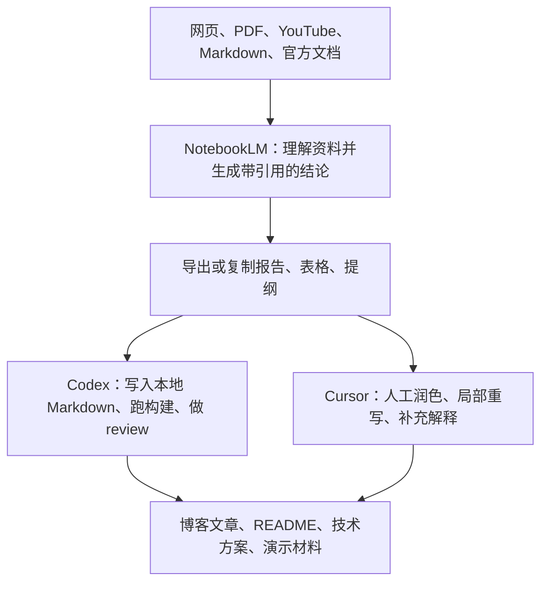

这篇文章整理自一个实际问题：看到 Substack 文章 [Claude Code + NotebookLM + Obsidian: The Research Stack Nobody's Using](https://substack.com/home/post/p-189067354) 后，我想把它背后的思路迁移到自己的写作和开发流程里。

原文的核心方向可以概括为一句话：**不要只把 AI 当聊天窗口，而要把它变成一套“资料收集、理解、整理、输出”的工作流。**

如果你还不熟悉 LLM 或 NotebookLM，可以先记住这三个角色：

- **NotebookLM**：帮你读资料、做总结、生成问答和展示材料。
- **Codex**：帮你在本地项目里读文件、改 Markdown、跑命令、检查 diff。
- **Cursor**：帮你在编辑器里边看代码边修改文章，适合人工参与更多的写作和调整。

这三个工具不是互相替代，而是分工协作。

## 基础概念

### 什么是 LLM

LLM 是 Large Language Model，也就是“大语言模型”。ChatGPT、Claude、Gemini 都属于这一类。

你可以把 LLM 理解成一个很强的文字和代码助手：

- 它可以读懂一段文字或代码。
- 它可以根据你的要求生成新内容。
- 它可以帮你整理结构、解释概念、写命令。
- 但它也可能犯错，尤其是资料不完整或问题问得太泛的时候。

所以在资料整理场景里，一个重要原则是：**让 AI 尽量基于明确资料回答，而不是凭空发挥。**

### 什么是 NotebookLM

NotebookLM 是 Google 的 AI 研究助手。官方帮助文档把它描述为一个能帮助你整理想法的 AI-powered research assistant。

它和普通聊天机器人的区别在于：你先给它资料，它再围绕这些资料回答。

这里有三个关键词：

| 概念 | 含义 | 例子 |
| --- | --- | --- |
| Notebook | 一个专题资料库 | `NotebookLM + Codex + Cursor 研究` |
| Source | 你上传或导入的资料 | PDF、网页、YouTube、Google Docs、Markdown |
| Citation | 回答里的引用依据 | NotebookLM 告诉你答案来自哪份 source |

因此，NotebookLM 更适合做“基于资料的研究”，不适合直接拿来做“没有依据的脑暴”。

### 什么是 Codex 和 Cursor

Codex 是 OpenAI 的 coding agent。它可以在本地仓库里读文件、改代码、跑测试、做 code review。

Cursor 是 AI code editor。它本质上是一个带 AI 能力的编辑器，也提供 Cursor Agent CLI，可以在终端里运行 agent。

简单区分：

| 工具 | 更适合做什么 |
| --- | --- |
| NotebookLM | 读资料、总结资料、生成报告、思维导图、音频/视频/幻灯片 |
| Codex | 在项目里自动修改文件、跑命令、检查构建、review 改动 |
| Cursor | 在编辑器里人工参与修改，边看上下文边调整文字和代码 |

## 为什么需要这个组合

如果只用 ChatGPT 或 Claude，你经常会遇到两个问题：

1. 资料太多，复制粘贴很麻烦。
2. AI 回答很像真的，但你不知道它到底依据哪份资料。

如果只用 NotebookLM，也会遇到问题：

1. 它擅长研究，但不擅长直接修改你的本地项目。
2. 个人版 NotebookLM 主要是网页产品，不是给开发者直接写脚本调用的工具。
3. 资料和输出如果只留在浏览器里，后续很难版本管理。

所以更稳的方案是：



这个流程的关键不是“全自动”，而是让每一步都有明确职责。

## 近半年值得关注的变化

我重新查了官方资料和最近半年技术讨论，NotebookLM 的用法已经从“上传 PDF 后总结”变成了更完整的研究和内容生产工具。

### 1. Deep Research 变重要了

Google 在 2025 年 11 月发布 NotebookLM Deep Research，官方说它可以根据问题生成研究计划、浏览大量网页、整理成有来源的报告，并把报告和 sources 加入 notebook。

这改变了 NotebookLM 的定位：它不只是读你上传的资料，也可以帮你先找资料。

适合这样用：

```text
请研究最近半年 NotebookLM 与 AI coding agent 的结合方式。
要求：
1. 优先查官方文档、工程博客和高质量技术讨论
2. 区分官方能力、第三方工具和个人经验
3. 输出适合写中文技术博客的结构
4. 每条结论附上来源
```

### 2. 不要只问“帮我总结”

最近社区里很火的一个经验是：不要一上传资料就问“总结一下”。这样得到的往往是浅层摘要。

更好的做法是先让 NotebookLM 建索引：

```text
请只基于当前 sources，列出这批资料覆盖的主要主题。
要求：
1. 只输出主题标题
2. 不要写长段总结
3. 合并重复主题
4. 标出哪些主题适合展开成博客小节
```

然后再追问某个主题：

```text
请展开“NotebookLM 和 coding agent 如何协作”这个主题。
要求：
1. 解释给没有 LLM 经验的人听
2. 给出具体操作步骤
3. 列出可以复制的命令
4. 区分官方功能和第三方非官方方案
```

### 3. MCP 和 CLI 自动化很热，但不适合新手第一步

最近很多帖子在讲 NotebookLM MCP、Claude Code/Cursor 直连 NotebookLM、用浏览器自动化批量上传资料。

这些方向有价值，但要先分清楚：

- **官方个人版 NotebookLM**：主要是网页使用，没有面向普通个人用户的稳定公开 API。
- **NotebookLM Enterprise API**：Google Cloud 文档已经提供 notebook、source、audio overview 等 API，但它属于 Enterprise/Cloud 场景，并且文档标注为 Pre-GA。
- **第三方 MCP/CLI**：多半通过浏览器自动化或非官方方式连接 NotebookLM，适合个人实验，不建议一开始就用于敏感资料。

所以对初学者来说，最稳的第一版工作流仍然是“文件流”：

```text
本地资料 -> NotebookLM -> 复制/导出报告 -> Codex/Cursor 写入项目
```

## 安装和会员选择

### NotebookLM

NotebookLM 不需要安装桌面软件，直接使用网页：

```text
https://notebooklm.google.com/
```

你需要一个 Google 账号。中国大陆个人账号访问和可用性可能受地区和网络环境影响；如果是 Workspace 账号，还要看组织管理员是否开启 NotebookLM。

官方额度会变化，以下是 2026-04-30 查到的官方帮助页信息：

| 版本 | 适合谁 | 关键额度 |
| --- | --- | --- |
| Standard | 个人轻量使用 | 100 个 notebooks、每个 50 个 sources、每天 50 次 chat |
| Google AI Plus | 入门付费用户 | 200 个 notebooks、每个 100 个 sources、每天 200 次 chat |
| Google AI Pro | 高频研究和写作 | 500 个 notebooks、每个 300 个 sources、每天 500 次 chat |
| Google AI Ultra | 重度生成展示材料 | 500 个 notebooks、每个 600 个 sources、每天 5K 次 chat |
| Google Cloud / Workspace | 公司、学校、企业资料 | 更强调权限、数据保护、审计和企业合规 |

普通个人写博客，建议先从 Standard 或 Google AI Pro 开始。只有当你每天都在生成报告、音频、视频、slide deck，或者一个主题需要大量 sources 时，再考虑更高版本。

### Codex

OpenAI 官方帮助页说明，Codex 包含在 ChatGPT Plus、Pro、Business、Enterprise/Edu 计划中；Free 和 Go 计划可能有阶段性额度，具体以账号页面为准。

安装命令：

```bash
# 方式 1：npm 安装
npm install -g @openai/codex

# 方式 2：macOS 用 Homebrew
brew install --cask codex

# 登录
codex login

# 进入项目
cd /path/to/your/repo
codex
```

### Cursor

Cursor 桌面端从官网下载：

```text
https://cursor.com/
```

Cursor CLI 安装命令：

```bash
curl https://cursor.com/install -fsS | bash

# zsh 用户如果命令找不到，可以把本地 bin 加到 PATH
echo 'export PATH="$HOME/.local/bin:$PATH"' >> ~/.zshrc
source ~/.zshrc

cursor-agent --version
cursor-agent login
```

Cursor 官方价格页当前显示：

| 版本 | 适合谁 |
| --- | --- |
| Hobby | 免费试用，少量 Agent 和 Tab 使用 |
| Pro | 日常个人开发，官方价格页显示 $20/月 |
| Pro+ | 更高模型用量，官方价格页显示 $60/月 |
| Ultra | 高频 Agent 用户，官方价格页显示 $200/月 |
| Teams / Enterprise | 团队账单、权限、隐私模式、SSO、审计 |

## NotebookLM 基础使用流程

### 第一步：创建 notebook

进入 NotebookLM 后，点击 `Create new notebook`。

建议一个主题建一个 notebook，例如：

- `NotebookLM + Codex + Cursor 工作流`
- `AI 编程工具资料库`
- `某个项目的产品文档`
- `某个技术专题研究`

不要把所有资料都塞到一个 notebook。官方帮助页也说明，每个 notebook 是独立的，NotebookLM 不能同时访问多个 notebooks 的内容。

### 第二步：添加 sources

NotebookLM 支持的常见 sources 包括：

- PDF
- Markdown
- 文本
- Google Docs
- Google Slides
- Google Sheets
- 网站 URL
- YouTube 视频
- 音频文件
- 图片
- Microsoft Word 等文档

对技术写作来说，推荐优先上传这些资料：

| Source 类型 | 适合放什么 |
| --- | --- |
| 官方文档 URL | API、安装命令、价格页、限制说明 |
| Markdown | 自己的笔记、项目 README、博客草稿 |
| PDF | 白皮书、论文、报告 |
| YouTube | 产品发布会、教程视频 |
| Google Docs | 经常变化、需要多人协作的资料 |

注意一个容易踩坑的点：**导入到 NotebookLM 的资料不是永远自动同步的。**官方文档也提示，导出到 Docs 或 Sheets 后再修改，不会同步回 NotebookLM。

我的建议是：

1. 原始资料保存在本地 Git 或 Google Drive。
2. NotebookLM 只作为研究和生成输出的中间层。
3. 重要结论最终回写到 Markdown。

### 第三步：先建索引，再问问题

新手常见问法：

```text
帮我总结这些资料。
```

更好的问法：

```text
请只基于当前 sources，帮我建立一个主题索引。
要求：
1. 用中文输出
2. 每个主题一句话解释
3. 标出适合写成博客小节的主题
4. 不要引入 sources 之外的信息
```

拿到主题索引后，再针对其中一个主题继续问：

```text
请展开“安装和会员选择”这个主题。
目标读者：没有使用过 NotebookLM，也不了解 LLM。
要求：
1. 先解释概念
2. 再给具体步骤
3. 命令放进 bash 代码块
4. 明确哪些信息可能随时间变化
```

### 第四步：生成展示材料

NotebookLM 的 Studio 面板可以生成：

- Notes
- Audio Overviews
- Video Overviews
- Mind maps
- Reports
- Data Tables
- Flashcards / Quizzes
- Slide Decks
- Infographics

实际写博客时，我推荐顺序是：

1. 先生成 `Briefing Document`。
2. 再生成 `Mind Map` 看结构是否合理。
3. 对重点问题继续追问。
4. 把稳定答案保存成 note。
5. 最后再生成 slide deck、infographic 或 data table。

## Codex 如何接入这个流程

Codex 负责本地项目里的执行工作。比如这篇文章最终要放到：

```text
src/content/blog/tech/ai/
```

可以先建一个研究目录：

```bash
mkdir -p research/notebooklm/sources
mkdir -p research/notebooklm/outputs
mkdir -p research/notebooklm/prompts
```

### 生成给 NotebookLM 上传的资料包

```bash
codex exec -C . -o research/notebooklm/sources/project-map.md "请阅读当前仓库，梳理 src/content/blog/tech/ai 下已有文章的主题、写作风格、frontmatter 结构，并输出给 NotebookLM 使用的 Markdown 资料包。不要修改文件。"
```

再生成一份研究问题清单：

```bash
codex exec -C . -o research/notebooklm/sources/research-questions.md "请为 NotebookLM + Codex + Cursor 这个主题生成研究问题。要求覆盖：基础概念、安装、会员、官方 API、第三方 MCP、具体命令、风险和最佳实践。"
```

然后把这两个 Markdown 上传到 NotebookLM。

### 把 NotebookLM 输出写回博客

假设你把 NotebookLM 的报告复制到了：

```text
research/notebooklm/outputs/notebooklm-report.md
```

让 Codex 写文章：

```bash
codex exec -C . "读取 research/notebooklm/outputs/notebooklm-report.md，更新 src/content/blog/tech/ai/notebooklm-codex-cursor-workflow.md。要求：面向 LLM 新手；保留 frontmatter；所有命令放进 bash 代码块；区分官方 API 和第三方工具；不要加入没有来源的结论。"
```

检查改动：

```bash
git diff -- src/content/blog/tech/ai/notebooklm-codex-cursor-workflow.md
codex review --uncommitted "检查文章是否存在事实错误、命令错误、链接错误，以及对新手不友好的跳跃解释。"
```

## Cursor 如何接入这个流程

Cursor 更适合做人工参与的编辑。

### 在编辑器里修改

```bash
cursor .
```

打开文章后，可以让 Cursor 参考 NotebookLM 输出：

```text
@research/notebooklm/outputs/notebooklm-report.md
@src/content/blog/tech/ai/notebooklm-codex-cursor-workflow.md

请只修改“NotebookLM 基础使用流程”这一节。
目标读者是不熟悉 LLM 的开发者。
要求：
1. 每个新概念先解释再使用
2. 保留命令块
3. 不要改 frontmatter
4. 删除重复表达
```

### 用 Cursor Agent CLI 修改

先只输出建议：

```bash
cursor-agent -p "读取 research/notebooklm/outputs/notebooklm-report.md，给出 src/content/blog/tech/ai/notebooklm-codex-cursor-workflow.md 的修改建议。重点检查新手是否能看懂。" --output-format text
```

确认工作区状态后，再允许它直接改文件：

```bash
git status --short
cursor-agent -p --force "读取 research/notebooklm/outputs/notebooklm-report.md，修订 src/content/blog/tech/ai/notebooklm-codex-cursor-workflow.md。要求保留 frontmatter，重点优化标题层级和新手解释。" --output-format text
```

## 官方 API 怎么看

这是旧版文章里最容易误导的地方，需要单独说明。

### 个人版 NotebookLM

对普通个人用户来说，NotebookLM 主要是网页产品。你可以上传文件、粘贴文字、导入 URL、生成报告和展示材料，但它不是一个可以直接用 API key 调用的消费级 API 产品。

所以个人使用时，不建议一开始就追求“全自动 API 化”。更稳的方式是：

```text
Codex/Cursor 整理资料包 -> 手动上传 NotebookLM -> 复制/导出结果 -> Codex/Cursor 写回本地
```

### NotebookLM Enterprise API

Google Cloud 文档已经有 NotebookLM Enterprise API，可以做这些事：

- 创建 notebook
- 获取 notebook
- 列出最近访问的 notebooks
- 批量删除 notebook
- 分享 notebook
- 批量添加 sources
- 上传文件 source
- 获取或删除 source
- 生成 audio overview

但它面向 Google Cloud / Gemini Enterprise / NotebookLM Enterprise 场景，并且文档标注为 Pre-GA。也就是说，它适合企业或高级用户，不是普通个人入门的第一步。

示例：创建 notebook。

```bash
export PROJECT_NUMBER="你的 Google Cloud project number"
export LOCATION="global"
export ENDPOINT_LOCATION="global"
export NOTEBOOK_TITLE="NotebookLM Codex Cursor Workflow"

curl -X POST \
  -H "Authorization:Bearer $(gcloud auth print-access-token)" \
  -H "Content-Type: application/json" \
  "https://${ENDPOINT_LOCATION}-discoveryengine.googleapis.com/v1alpha/projects/${PROJECT_NUMBER}/locations/${LOCATION}/notebooks" \
  -d "{
    \"title\": \"${NOTEBOOK_TITLE}\"
  }"
```

示例：上传 Markdown 文件作为 source。

```bash
export NOTEBOOK_ID="你的 notebook id"
export FILE_PATH="research/notebooklm/sources/project-map.md"
export FILE_DISPLAY_NAME="project-map.md"

curl -X POST --data-binary "@${FILE_PATH}" \
  -H "Authorization:Bearer $(gcloud auth print-access-token)" \
  -H "X-Goog-Upload-File-Name: ${FILE_DISPLAY_NAME}" \
  -H "X-Goog-Upload-Protocol: raw" \
  -H "Content-Type: text/markdown" \
  "https://${ENDPOINT_LOCATION}-discoveryengine.googleapis.com/upload/v1alpha/projects/${PROJECT_NUMBER}/locations/${LOCATION}/notebooks/${NOTEBOOK_ID}/sources:uploadFile"
```

如果 source 来自 Google Docs 或 Google Slides，还需要给 `gcloud` 授权 Google Drive 访问：

```bash
gcloud auth login --enable-gdrive-access
```

## 第三方 MCP 和自动化工具

最近半年，很多开发者在尝试把 NotebookLM 接到 Claude Code、Cursor、Codex 等 agent 里。常见做法包括：

- 用 MCP server 让 agent 查询 NotebookLM。
- 用 Chrome 自动化复用登录状态。
- 用脚本批量上传资料、批量生成报告。
- 把 NotebookLM 回答保存到本地 Markdown，形成可复用研究档案。

这类方案的价值是减少复制粘贴，但风险也很明确：

| 风险 | 说明 |
| --- | --- |
| 非官方稳定性 | 可能依赖页面结构、浏览器会话或第三方包 |
| 数据安全 | cookie、Google 账号、公司资料都需要谨慎 |
| 维护成本 | NotebookLM 页面或权限变化后，工具可能失效 |
| 新手成本 | 还没理解 NotebookLM，就先调 MCP，容易排错困难 |

因此我的建议是：

1. 先掌握手动文件流。
2. 再用 Codex/Cursor 固化本地 Markdown 输出。
3. 最后再尝试 MCP 或浏览器自动化。

实验命令示例：

```bash
# 示例：第三方 NotebookLM MCP，实际以项目 README 为准
uv tool install notebooklm-mcp-2026
notebooklm-mcp-2026 setup
```

如果只是写个人博客，这一步不是必须的。

## 推荐工作流

### 轻量写作

适合每周写一两篇技术博客。

```bash
mkdir -p research/notebooklm/sources research/notebooklm/outputs

codex exec -C . -o research/notebooklm/sources/project-map.md "梳理当前仓库 AI 博客文章结构，输出给 NotebookLM 使用的资料包。不要修改文件。"
```

然后在 NotebookLM 中：

1. 新建 notebook。
2. 上传 `project-map.md`。
3. 添加官方文档 URL。
4. 用 Deep Research 补充最近资料。
5. 生成 briefing document。
6. 复制到 `research/notebooklm/outputs/notebooklm-report.md`。

最后执行：

```bash
codex exec -C . "根据 research/notebooklm/outputs/notebooklm-report.md 写成一篇中文技术博客，放到 src/content/blog/tech/ai/。要求面向新手，保留来源链接。"
npm run build
```

### 技术资料库

适合长期维护某个主题。

```text
原始资料：Git / Google Drive / PDF / 网页
研究层：NotebookLM
归档层：research/notebooklm/outputs/*.md
发布层：src/content/blog/tech/ai/*.md
检查层：git diff + codex review
```

对应命令：

```bash
git status --short
git diff -- src/content/blog/tech/ai/
codex review --uncommitted "检查文章事实、命令、链接和对新手的解释是否充分。"
```

### 团队或企业资料

适合公司内部知识库、客户资料、合规要求较高的场景。

优先考虑：

- Google Workspace 管理权限
- Google Cloud / NotebookLM Enterprise
- 明确的数据处理政策
- 不把敏感资料交给第三方浏览器自动化工具

## 常见误区

### 误区 1：NotebookLM 会自动帮我判断资料真假

不会。NotebookLM 可以基于 sources 回答，但 source 本身可能过期、错误或有偏见。

发布文章前，会员价格、额度、API 状态必须回到官方页面重新确认。

### 误区 2：NotebookLM 可以替代 Codex/Cursor

不适合。NotebookLM 擅长研究和总结，不擅长直接修改本地 Git 仓库。

真正落地到文章或代码，还是要靠 Codex/Cursor。

### 误区 3：MCP 一定比手动复制更高级

不一定。对新手来说，手动流程更容易理解，也更容易排错。

只有当你已经稳定重复同一套流程，再考虑自动化。

### 误区 4：把资料全部丢进一个 notebook 最省事

短期省事，长期会乱。主题越混杂，回答越容易变浅。

更好的方式是：

- 一个项目一个 notebook。
- 一个研究主题一个 notebook。
- 输出结果回写到本地 Markdown。

## 结论

NotebookLM 最值得用的地方，不是“让 AI 替你写文章”，而是把资料变成可追问、可引用、可展示的知识库。

Codex 和 Cursor 的价值，是把 NotebookLM 生成的研究结果真正落到本地项目里：

- 变成博客文章。
- 变成 README。
- 变成技术方案。
- 变成可 review、可构建、可版本管理的内容。

对刚接触 LLM 和 NotebookLM 的人，推荐从这个顺序开始：

1. 先用 NotebookLM 手动上传资料并提问。
2. 再用 Codex 生成本地资料包和文章初稿。
3. 用 Cursor 做人工编辑和局部润色。
4. 最后再研究 NotebookLM Enterprise API 或第三方 MCP。

这个顺序最稳，也最容易形成长期可复用的写作和研究系统。

## 资料来源

- [Substack: Claude Code + NotebookLM + Obsidian: The Research Stack Nobody's Using](https://substack.com/home/post/p-189067354)
- [NotebookLM Help: Learn about NotebookLM](https://support.google.com/notebooklm/answer/16164461?co=GENIE.Platform%3DDesktop&hl=en)
- [NotebookLM Help: Create a notebook](https://support.google.com/notebooklm/answer/16206563?hl=en)
- [NotebookLM Help: Upgrade NotebookLM](https://support.google.com/notebooklm/answer/16213268?hl=en)
- [Google Blog: NotebookLM adds Deep Research and support for more source types](https://blog.google/innovation-and-ai/models-and-research/google-labs/notebooklm-deep-research-file-types/)
- [Google Cloud: NotebookLM Enterprise overview](https://docs.cloud.google.com/gemini/enterprise/notebooklm-enterprise/docs/overview)
- [Google Cloud: Create and manage notebooks API](https://docs.cloud.google.com/gemini/enterprise/notebooklm-enterprise/docs/api-notebooks)
- [Google Cloud: Add and manage data sources API](https://docs.cloud.google.com/gemini/enterprise/notebooklm-enterprise/docs/api-notebooks-sources)
- [OpenAI Help: Using Codex with your ChatGPT plan](https://help.openai.com/en/articles/11369540)
- [OpenAI Codex GitHub repository](https://github.com/openai/codex)
- [Cursor CLI](https://cursor.com/cli)
- [Cursor Pricing](https://cursor.com/pricing)
- [Reddit: Stop asking NotebookLM to summarize your sources](https://www.reddit.com/r/notebooklm/comments/1rse4wp/title_stop_asking_notebooklm_to_summarize_your/)
- [Reddit: NotebookLM with Deep Research structured prompt discussion](https://www.reddit.com/r/notebooklm/comments/1pee6t1/notebooklm_with_deep_research_it_is_now_better_to/)
- [Reddit: NotebookLM + Claude Code plugin discussion](https://www.reddit.com/r/notebooklm/comments/1r605ja/notebooklm_claude_code_built_a_plugin_that/)
